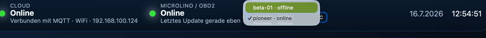
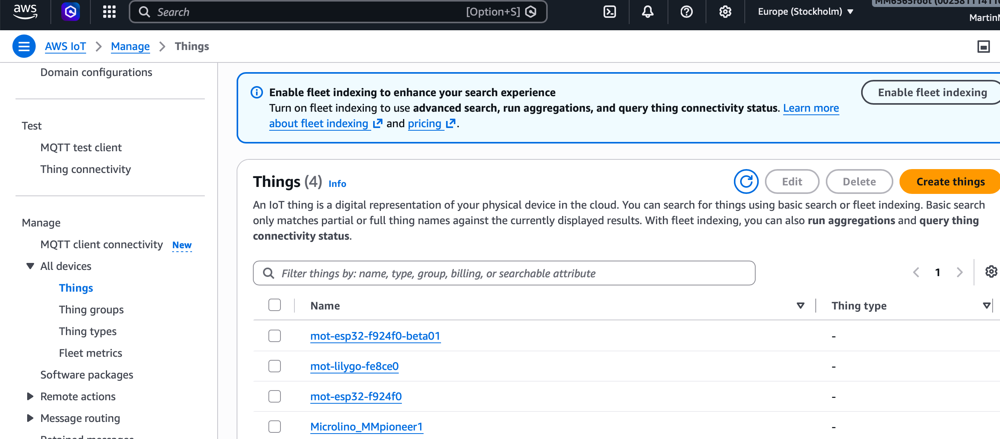
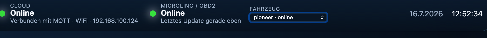

# Microlino Open Telemetry

Open-source telemetry platform for Microlino vehicles, built around modular
ESP32 firmware, AWS IoT Core, a current-state cloud backend and a
multi-vehicle web dashboard.

> **Project status:** Cloud foundation beta (`v0.9.x`)  
> **Primary region:** `eu-north-1`  
> **Production transport:** MQTT over TLS/X.509 to AWS IoT Core



## What MOT provides

MOT connects vehicle telemetry to a secure cloud platform:

```text
Microlino
  -> CAN / OBD-II
  -> ESP32-WROOM or LilyGO T-A7670X
  -> shared MotAwsIot library
  -> AWS IoT Core
  -> IoT Rule and Lambda
  -> DynamoDB current state
  -> Vehicle REST API
  -> multi-vehicle Dashboard
```

Current capabilities include:

- ESP32-WROOM and LilyGO T-A7670X firmware
- shared AWS IoT transport through `MotAwsIot`
- mutual TLS with one X.509 identity per physical device
- Wi-Fi cloud transport for both supported boards
- CAN/OBD-II telemetry decoding
- retained online state and MQTT Last Will
- heartbeat and UTC-based last-seen reporting
- AWS IoT Rule ingestion
- multi-vehicle current-state storage in DynamoDB
- read-only Vehicle REST API
- web dashboard with vehicle switching
- optional local MQTT debug path

## Repository structure

```text
firmware/
├── esp32-wroom/
├── lilygo-t-a7670/
└── shared-libs/
    └── MotAwsIot/

dashboard/
cloud/
tools/
docs/
├── adr/
├── architecture/
├── reference/
└── images/

private/
└── aws/                  # ignored device credentials
```

## Supported firmware targets

| Target | Network | Cloud path | Notes |
|---|---|---|---|
| ESP32-WROOM | Wi-Fi | AWS IoT Core | CAN/OBD-II reference board |
| LilyGO T-A7670X | Wi-Fi | AWS IoT Core | LTE remains separate/experimental |
| Legacy debug builds | Wi-Fi or LTE, depending on board | Plain MQTT | Development only |

## Cloud architecture

The production dashboard does not connect directly to MQTT. Firmware sends
telemetry to AWS IoT Core, while applications read an API-oriented current
state.

This separation keeps device credentials out of the browser and prepares the
platform for authenticated multi-user access.



## Dashboard

The Dashboard loads the available vehicles from the Vehicle API and polls the
selected vehicle snapshot. When multiple vehicle IDs are present, the header
shows a selector.



## Documentation

Start with:

1. [Introduction](docs/reference/01-introduction.md)
2. [Design principles](docs/reference/02-design-principles.md)
3. [Terminology](docs/reference/03-terminology.md)
4. [Documentation principles](docs/adr/ADR-000-documentation-principles.md)

The detailed hardware, firmware, cloud, API, security and development
reference follows in subsequent `v0.9.1` documentation packages.

## License
See  the repository license.

## 👥 Contributors

Thanks to Wolfgang for his support in decoding OBD2 registers on standard bus and the hint to use Display-CAN in the initial version for both, the Microlino Pioneer series and the newer models.

* [Wolfgang] (https://github.com/wolfijenne) –

## Security essentials

- Never commit private keys, client certificates or AWS access keys.
- Store device identities below `private/aws/<thing-name>/`.
- Upload credentials to device LittleFS only during provisioning.
- Use a separate AWS Thing, certificate and MQTT client ID per physical device.
- Treat plain MQTT as a local debug mechanism, not a production path.
- The temporary Vehicle API must gain Cognito authorization before public
  end-user deployment.

## Current milestone

The Cloud Foundation milestone has validated:

- LilyGO and ESP32-WROOM publishing as separate devices
- multiple vehicle partitions in DynamoDB
- Vehicle API snapshots
- Dashboard switching between vehicles
- correct reset of vehicle-specific UI state
- shared AWS IoT firmware transport

## Road ahead

Near-term work:

1. GPS integration for ESP32-WROOM
2. Cognito and user-to-vehicle authorization
3. production API security
4. OTA and device lifecycle management
5. trip/history storage
6. LTE transport to AWS IoT
7. ABRP cloud integration
8. Device Shadow and IoT Jobs

## License and contribution

See the repository's `LICENSE`, `CONTRIBUTING.md` and `SECURITY.md` files for
the authoritative project policies.
