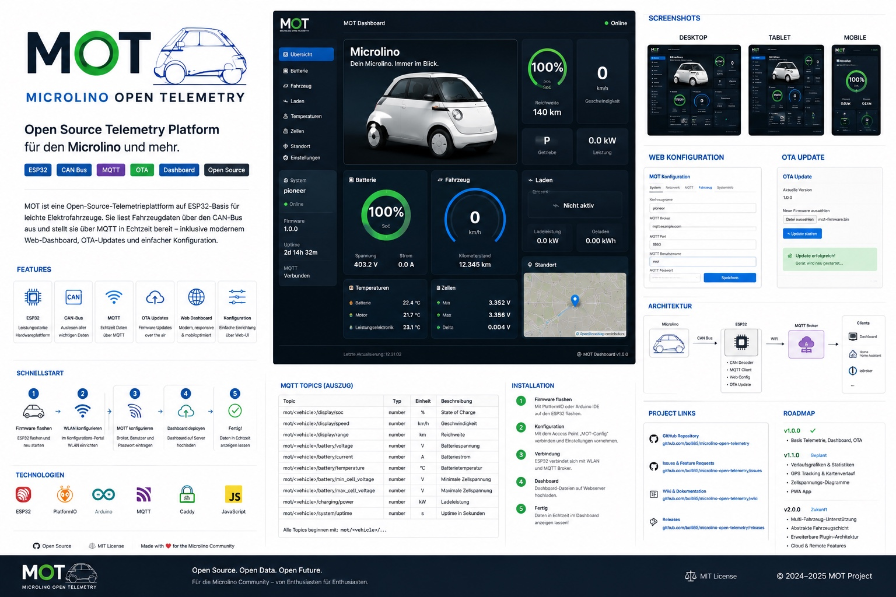
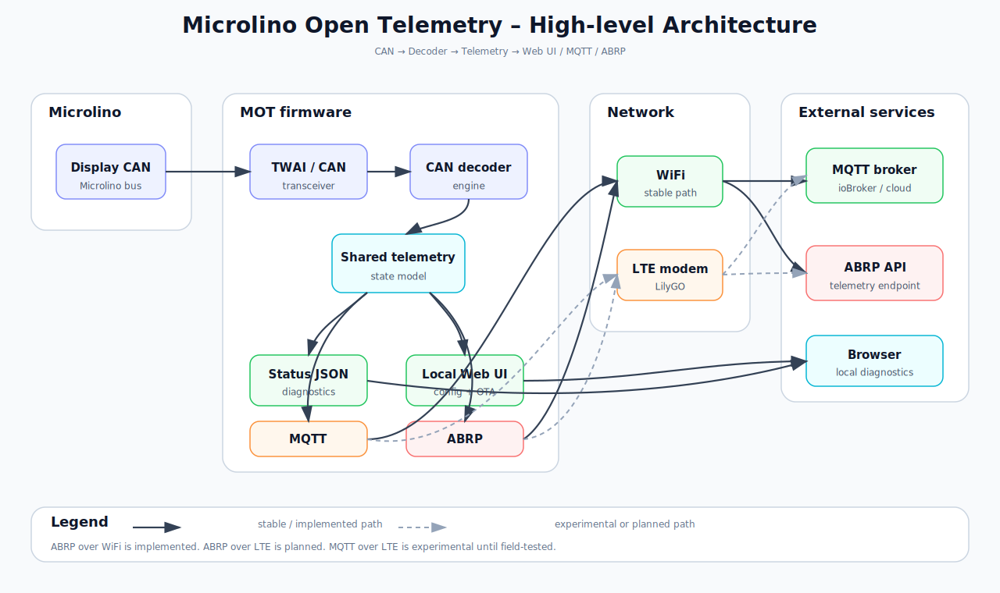

# MOT – Microlino Open Telemetry



**MOT** is an open-source telemetry platform for the Microlino and other lightweight electric vehicles. It combines an ESP32 firmware, CAN decoding, MQTT telemetry, OTA firmware updates and a responsive web dashboard.


## Highlights

- ESP32-WROOM / CAN485 / LilyGo LTE/GNSS firmware for CAN telemetry
- MQTT topic structure: `mot/<vehicle>/...`
- Responsive dashboard for desktop, tablet and iPhone
- Secure dashboard access through MQTT over WebSocket / WSS
- OTA firmware update with password protection
- Configurable vehicle name, vehicle ID and MQTT prefix
- Default map location or GPS support
- Designed for LilyGO LTE/GNSS support

## Dashboard

| Home | Battery |
|---|---|
|  |  |

| Vehicle | Location |
|---|---|
|  |  |

## Architecture



```text
Microlino CAN Bus
        ↓
ESP32-WROOM / CAN 485 / LilyGo LTE/GNSSFirmware
        ↓
MQTT Broker
        ↓
Dashboard / ioBroker / Home Assistant
```

## Quick Start

1. Build and flash the ESP32 firmware with PlatformIO.
2. Connect to the MOT setup access point.
3. Configure WiFi, MQTT ABRP, and OTA password.
4. Upload the dashboard to a web server.
5. Configure `dashboard/config.js`.
6. Open the dashboard and verify live telemetry.

See [Installation](docs/getting-started/installation.md).

## Documentation

- [Documentation overview](docs/README.md)
- [Installation](docs/getting-started/installation.md)
- [Configuration](docs/getting-started/configuration.md)
- [Dashboard](docs/dashboard/overview.md)
- [MQTT Topics](docs/firmware/mqtt-topics.md)
- [OTA](docs/firmware/ota.md)
- [Hardware](docs/hardware/esp32.md)
- [FAQ](docs/faq.md)

## MQTT Topic Model

```text
mot/<vehicle>/display/soc
mot/<vehicle>/display/speed_kmh
mot/<vehicle>/display/odometer_km
mot/<vehicle>/charging/is_charging
mot/<vehicle>/system/device_id
```

## v1.0.x Scope

Version 1.0 focuses on a stable ESP32-WROOM release with WiFi, MQTT, ABRP, OTA and the responsive dashboard. LTE/GNSS and LilyGO are supported (with the exception for ABRP over LTE)

## License

MIT License.
