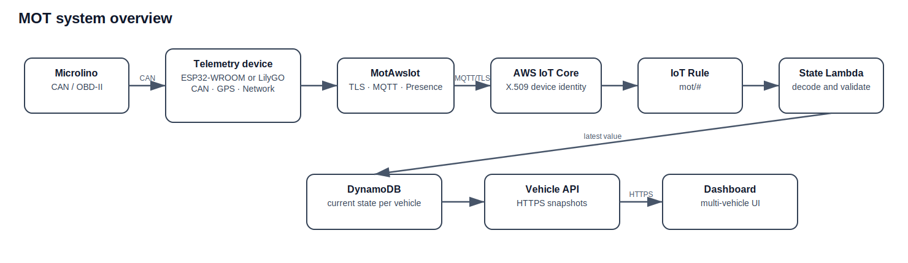
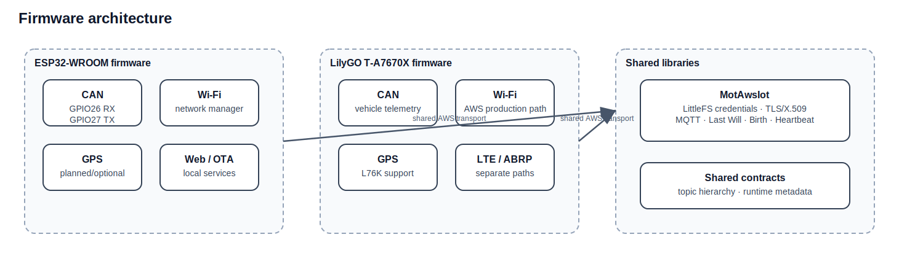
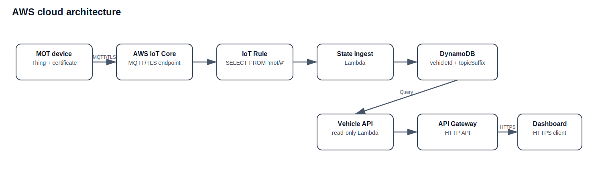
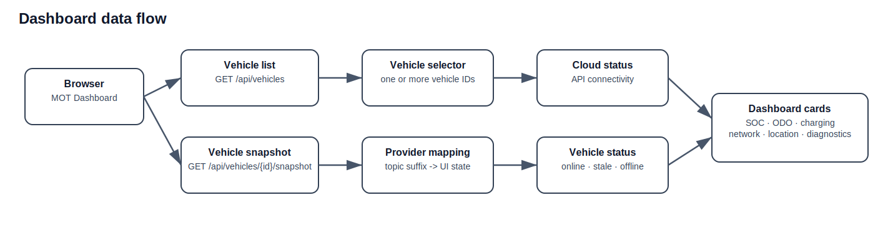

# Architecture diagrams

This directory contains the editable Draw.io sources and SVG exports for the
current MOT architecture.

## Diagram set

| Diagram | Purpose |
|---|---|
| `system-overview` | End-to-end path from Microlino to Dashboard |
| `firmware` | Board-specific firmware and shared `MotAwsIot` boundary |
| `aws-cloud` | AWS IoT ingestion, current state and Vehicle API |
| `dashboard` | Vehicle list, snapshot polling and UI state flow |

## Files

Each maintained diagram has:

```text
<name>.drawio
<name>.svg
```

The Draw.io file is the editable source of truth. The SVG is used in Markdown
and GitHub rendering.

## Preview









## Update rules

- keep labels consistent with `docs/reference/03-terminology.md`
- do not include secrets, private endpoints or account identifiers
- update both the editable source and SVG export
- create or update an ADR when a diagram change represents a durable
  architecture decision
