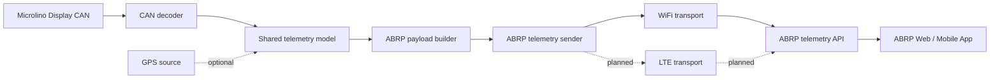

# ABRP Architecture

ABRP receives telemetry from the firmware through the ABRP telemetry endpoint.

## ABRP data flow



## Data source

```text
CAN decoder
  -> telemetry model
  -> ABRP payload
```

## Payload

Typical payload fields:

```text
soc
utc
speed
power
is_charging
lat
lon
```

Latitude and longitude are only sent when a valid GPS source exists.

- ESP32-WROOM: no GPS assumed, do not send lat/lon.
- LilyGO: send lat/lon only when L76K GPS has a valid fix.

If lat/lon are missing, ABRP may report:

```text
Missing telemetry: lat, lon
```

This is acceptable when no GPS source is available. ABRP can then use location from the mobile app.

## Transport

Current status:

| Target | ABRP transport |
|---|---|
| ESP32-WROOM | WiFi |
| LilyGO | WiFi |
| LilyGO LTE | planned / not yet final |

## LilyGO endpoints

```text
GET  /api/lilygo/abrp
POST /api/lilygo/abrp/test
```

The status includes:

- enabled
- configured
- transport
- transportAvailable
- timeValid
- lastSuccess
- HTTP code
- ABRP response message
- last payload
