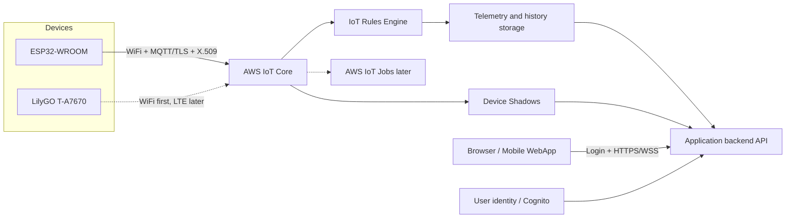
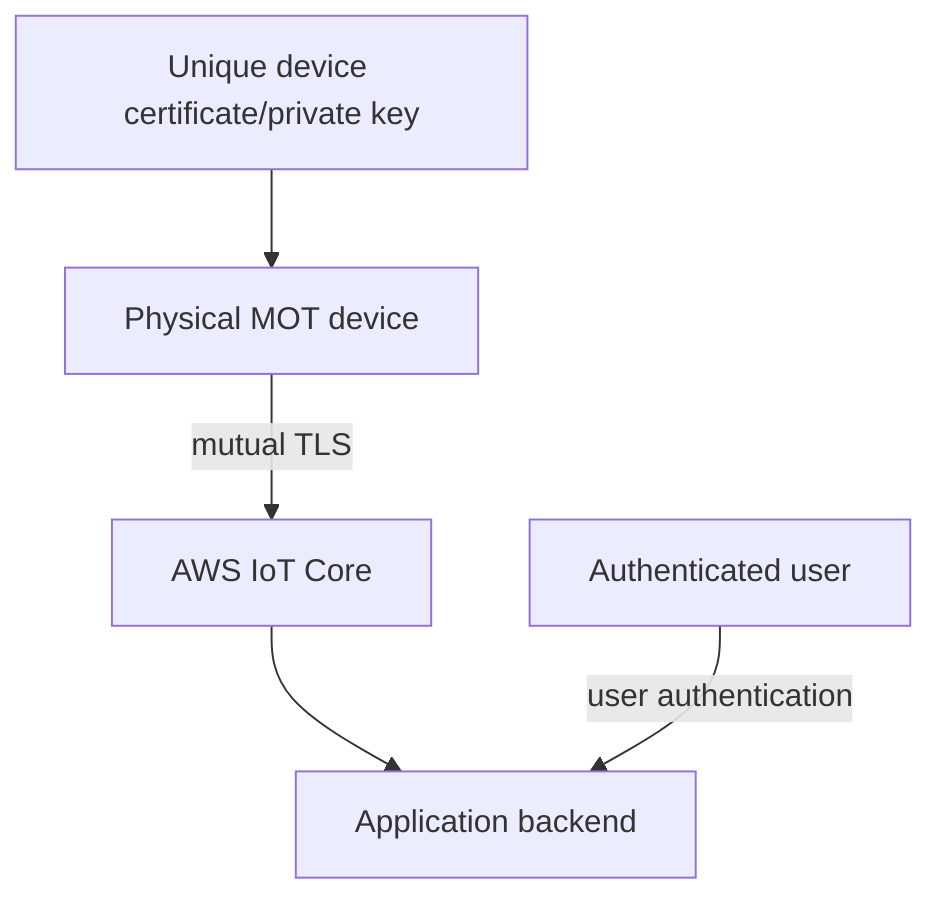
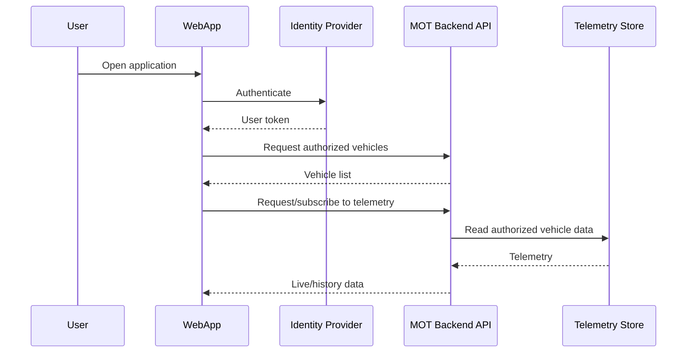

# AWS IoT architecture

> 🧪 **Status:** Target architecture. The first implementation uses ESP32-WROOM over WiFi. LilyGO LTE is deliberately excluded from the first cloud test.

## Overview



## Trust boundaries



The device certificate authenticates a physical device. It does not authenticate a human user. The application backend maps users to vehicles and enforces authorization.

## Device identity

Recommended Thing name:

```text
mot-<board>-<device-suffix>
```

Examples:

```text
mot-esp32-f924f0
mot-lilygo-fe8ce0
```

The MQTT client ID should exactly match the Thing name.

## Topic permissions

Initial compatibility namespace:

```text
mot/<vehicleId>/#
```

Target policy behavior:

```text
device may connect only as its Thing name
device may publish only to its telemetry/status namespace
device may subscribe/receive only from its commands/configuration namespace
```

Future namespace:

```text
mot/v1/<thingName>/telemetry/#
mot/v1/<thingName>/status/#
mot/v1/<thingName>/commands/#
mot/v1/<thingName>/configuration/#
```

## WebApp architecture



## Device Shadow use

| Shadow | Purpose |
|---|---|
| `status` | firmware, network mode, last seen, summary state |
| `configuration` | reporting intervals and future remote settings |
| `ota` | desired and reported firmware version |

## Failure modes

| Failure | Expected behavior |
|---|---|
| WiFi unavailable | Local AP/WebUI remains available |
| AWS unavailable | Device retries with backoff; local functions remain available |
| Certificate revoked | Only that device loses cloud access |
| Invalid UTC | TLS connection withheld |
| Backend unavailable | Device can still publish to AWS IoT Core |
| WebApp offline | Device operation is unaffected |

## See also

- [ADR-0004](../adr/ADR-0004-aws-iot-target-architecture.md)
- [Firmware MQTT](../firmware/mqtt.md)
- [Firmware network](../firmware/network.md)
- [AWS credential handling](../security/aws-iot-credentials.md)
