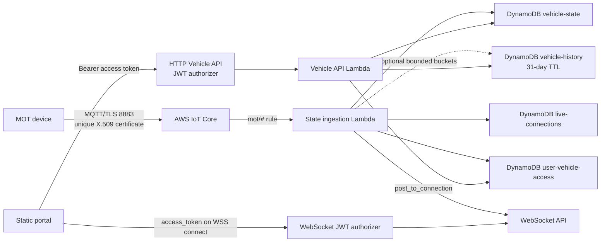
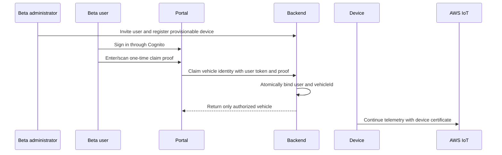

# AWS IoT and Portal Architecture

> **Status:** Partially implemented
>
> **Audience:** Developer, administrator and security reviewer
>
> **Last verified:** Live path 2026-08-03 against code and AWS; history 2026-08-04 locally only

## Implemented data path


```mermaid
flowchart LR
    Device["MOT device"] -->|"MQTT/TLS 8883\nunique X.509 certificate"| IoT["AWS IoT Core"]
    IoT -->|"mot/# rule"| Ingest["State ingestion Lambda"]
    Ingest --> State["DynamoDB vehicle-state"]
    Ingest -.->|"optional bounded buckets"| History["DynamoDB vehicle-history\n31-day TTL"]
    Ingest --> Connections["DynamoDB live-connections"]
    Ingest --> Access["DynamoDB user-vehicle-access"]
    Ingest -->|"post_to_connection"| WSS["WebSocket API"]

    Portal["Static portal"] -->|"Bearer access token"| HTTP["HTTP Vehicle API\nJWT authorizer"]
    HTTP --> VehicleApi["Vehicle API Lambda"] --> State
    VehicleApi --> Access
    VehicleApi --> History
    Portal -->|"access_token on WSS connect"| Authorizer["WebSocket JWT authorizer"]
    Authorizer --> WSS
```

The browser never receives device certificates or private keys.

## Identity domains

| Identity | Current representation | Purpose |
|---|---|---|
| Device | AWS IoT Thing name + X.509 certificate | Authenticate one physical device to AWS IoT |
| Vehicle | `vehicleId` in topic and DynamoDB partition key | Group telemetry for a vehicle |
| User | Cognito `sub` in access token | Authenticate a portal user |
| Ownership/access | `UserVehicleAccess` keyed by Cognito `sub` + `vehicleId` | Authorize portal REST/WebSocket access |

The ownership/access relationship is deployed in development and defaults to deny.
ONB-001.A validated isolation with two controlled Cognito identities, including
guessed-ID denial and live revocation/recovery. Production configuration and the
controlled claim lifecycle remain release gates.

## Required onboarding boundary


```mermaid
sequenceDiagram
    participant Admin as Beta administrator
    participant User as Beta user
    participant Portal
    participant Backend
    participant Device
    participant IoT as AWS IoT

    Admin->>Backend: Invite user and register provisionable device
    User->>Portal: Sign in through Cognito
    User->>Portal: Enter/scan one-time claim proof
    Portal->>Backend: Claim vehicle identity with user token and proof
    Backend->>Backend: Atomically bind user and vehicleId
    Backend-->>Portal: Return only authorized vehicle
    Device->>IoT: Continue telemetry with device certificate
```

This is the reviewed B2/B3 boundary, not yet an implemented API contract. The
physical `deviceId`, Thing and certificate are inventory/provisioning identities;
they are not added to the B2 DynamoDB claim transaction. Replacement and transfer
use the separate, resumable B3 lifecycle.

## Device credentials

Each beta device must have its own:

- AWS IoT Thing;
- certificate and private key;
- least-privilege IoT policy;
- Thing name used as MQTT client ID;
- explicit vehicle association.

Current firmware loads the AWS endpoint, Thing name, vehicle ID, root CA,
certificate and private key from LittleFS. Local credential folders are temporary
operator inputs and are ignored by Git.

## Current topic namespace

```text
mot/<vehicleId>/display/...
mot/<vehicleId>/charging/...
mot/<vehicleId>/bms/...
mot/<vehicleId>/location/...
mot/<vehicleId>/system/...
mot/<vehicleId>/status/...
```

The current IoT Rule consumes `mot/#`. Per-device IoT policy enforcement and
server-side vehicle access enforcement remain distinct controls.

The state-ingestion Lambda stores topic suffixes generically, so the repository's
new pack voltage/current/power and provisional cell-extrema suffixes need no
backend schema migration. Portal rendering and all three firmware-family
publishers are implemented. The C6 AWS profiles compile, but C6 credentials,
physical WiFi/TLS publication and hosted-portal display remain unvalidated.

## History pilot

The repository now contains a disabled-by-default bounded history side path and an
authorized history endpoint. It is not yet deployed or AWS-validated. See
[Telemetry history pilot](telemetry-history.md).

## Not currently implemented

- deployed account invitation/device-claim backend (B1/B2 exist locally only);
- production telemetry history beyond the bounded pilot;
- Device Shadow integration;
- Fleet Provisioning and certificate rotation;
- remote OTA/AWS IoT Jobs;
- ownership transfer and self-service recovery.

## Related documents

- [AWS IoT target ADR](../adr/ADR-0004-aws-iot-target-architecture.md)
- [Email delivery and domain operations](../administrator/aws/email-delivery.md)
- [Authentication](authentication.md)
- [Credential handling](../security/aws-iot-credentials.md)
- [Active work](../governance/WORK_ORDER.md)
- [AWS roadmap](../roadmap/aws-iot.md)
