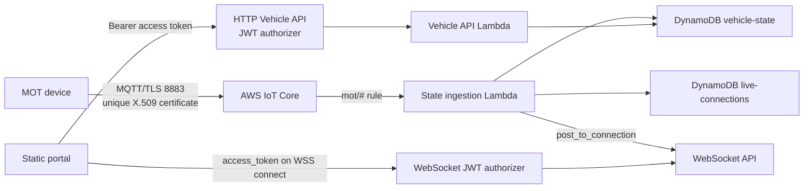
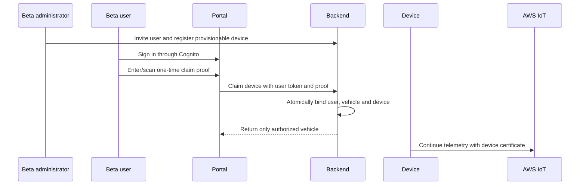

# AWS IoT and Portal Architecture

> **Status:** Partially implemented
>
> **Audience:** Developer, administrator and security reviewer
>
> **Last verified:** 2026-07-31 against code and CloudFormation; deployed state unknown

## Implemented data path


```mermaid
flowchart LR
    Device["MOT device"] -->|"MQTT/TLS 8883\nunique X.509 certificate"| IoT["AWS IoT Core"]
    IoT -->|"mot/# rule"| Ingest["State ingestion Lambda"]
    Ingest --> State["DynamoDB vehicle-state"]
    Ingest --> Connections["DynamoDB live-connections"]
    Ingest -->|"post_to_connection"| WSS["WebSocket API"]

    Portal["Static portal"] -->|"Bearer access token"| HTTP["HTTP Vehicle API\nJWT authorizer"]
    HTTP --> VehicleApi["Vehicle API Lambda"] --> State
    Portal -->|"access_token on WSS connect"| Authorizer["WebSocket JWT authorizer"]
    Authorizer --> WSS
```

The browser never receives device certificates or private keys.

## Identity domains

| Identity | Current representation | Purpose |
|---|---|---|
| Device | AWS IoT Thing name + X.509 certificate | Authenticate one physical device to AWS IoT |
| Vehicle | `vehicleId` in topic and DynamoDB partition key | Group telemetry for a vehicle |
| User | Cognito `sub` in access token | Authenticate a portal user |
| Ownership/access | Not implemented | Decide which user may access which vehicle |

The missing ownership/access relationship is a release blocker for an untrusted
multi-user beta. A valid Cognito token currently permits listing and subscribing to
vehicles without a per-user assignment check.

## Required onboarding boundary


```mermaid
sequenceDiagram
    participant Admin as Beta administrator
    participant User as Beta user
    participant Portal
    participant Backend
    participant Device
    participant IoT as AWS IoT

    Admin->>Backend: Invite user and register provisionable device
    User->>Portal: Sign in through Cognito
    User->>Portal: Enter/scan one-time claim proof
    Portal->>Backend: Claim device with user token and proof
    Backend->>Backend: Atomically bind user, vehicle and device
    Backend-->>Portal: Return only authorized vehicle
    Device->>IoT: Continue telemetry with device certificate
```

This is the intended boundary, not yet an implemented API contract. Claim proofs,
expiry, retry limits, replacement and recovery still require a reviewed design.

## Device credentials

Each beta device must have its own:

- AWS IoT Thing;
- certificate and private key;
- least-privilege IoT policy;
- Thing name used as MQTT client ID;
- explicit vehicle association.

Current firmware loads the AWS endpoint, Thing name, vehicle ID, root CA,
certificate and private key from LittleFS. Local credential folders are temporary
operator inputs and are ignored by Git.

## Current topic namespace

```text
mot/<vehicleId>/display/...
mot/<vehicleId>/charging/...
mot/<vehicleId>/location/...
mot/<vehicleId>/system/...
mot/<vehicleId>/status/...
```

The current IoT Rule consumes `mot/#`. Per-device IoT policy enforcement and
server-side vehicle access enforcement remain distinct controls.

## Not currently implemented

- user-to-vehicle access table and enforcement;
- account invitation/device-claim backend;
- cloud telemetry history service;
- Device Shadow integration;
- Fleet Provisioning and certificate rotation;
- remote OTA/AWS IoT Jobs;
- ownership transfer and self-service recovery.

## Related documents

- [AWS IoT target ADR](../adr/ADR-0004-aws-iot-target-architecture.md)
- [Authentication](authentication.md)
- [Credential handling](../security/aws-iot-credentials.md)
- [Active work](../governance/WORK_ORDER.md)
- [AWS roadmap](../roadmap/aws-iot.md)
