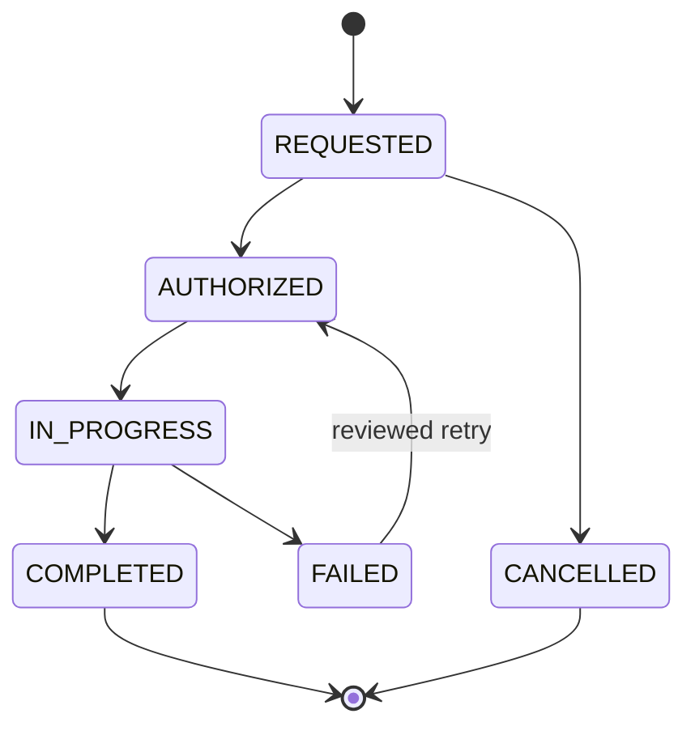

# Onboarding Device Lifecycle

> **Status:** Planned design for ONB-001.B3 — not implemented
>
> **Audience:** Backend developer, device provisioner, support operator and security reviewer
>
> **Last verified:** 2026-08-03 against branch `codex/spr-0005-beta-onboarding-readiness`

## Purpose

Define safe, explicit workflows for adapter replacement, ownership transfer, loss,
factory reset, recovery and retirement. These workflows extend the B2 claim model;
they do not expose AWS IoT credentials to users or the portal.

## Identity decisions

The four identity domains remain independent:

| Domain | Stable during adapter replacement? | Stable during ownership transfer? |
|---|---:|---:|
| Cognito user `sub` | Yes | No |
| Portal identity `vehicleId` | Yes by default | Yes by default |
| Physical adapter `deviceId` | No | Yes if the adapter itself is transferred |
| IoT Thing and certificate | No | Certificate is always rotated before reassignment |

An ordinary defect replacement retains `vehicleId`, portal ownership and any future
vehicle-level history. It creates a new inventory `deviceId`, Thing and certificate,
then retires the old cloud device identity. An administrator may instead retire the
old `vehicleId` and onboard a separate identity when the units intentionally remain
independent, as they currently do for parallel WROOM and LilyGO beta testing.

Keeping `vehicleId` is a reviewed operator choice, never something inferred from a
factory reset, matching telemetry or a user-entered device identifier.

## Lifecycle operation record

Every mutation is represented by a versioned operation record conforming to
`cloud/aws/onboarding/schemas/lifecycle-operation-record.schema.json`. The record
contains identifiers, state and controlled reason codes only. It contains no email,
password, claim proof, private key, certificate body, token, telemetry or free-form
support notes.

`operationId` is the idempotency key. A retry resumes the recorded operation; it
must not create another Thing, certificate, ownership or access record. State changes
use optimistic `version` conditions and append privacy-safe audit events.

## Workflow matrix

| Event | Access action | Device credential action | Default identity result |
|---|---|---|---|
| Replace defective adapter | Keep current owner | Create new Thing/certificate, validate, deactivate old certificate | Keep `vehicleId`; replace `deviceId` |
| Report adapter lost/stolen | Keep ownership but suspend device ingestion | Immediately deactivate old certificate | Keep `vehicleId`; device state `LOST` |
| Recover previously lost adapter | Explicit administrator review | Issue a new certificate; never reactivate or reuse the old private key | Keep identities if inventory match is proven |
| Factory reset | No ownership change | Rotate credentials if private-key preservation cannot be proven | Keep `vehicleId`; no automatic new Thing |
| Transfer ownership | Revoke old access, then create new ownership/access | Rotate certificate before the new owner receives the adapter | Keep `vehicleId` unless explicitly retired |
| Retire adapter/vehicle identity | Revoke access according to retention decision | Deactivate certificate and detach policy/Thing associations | Mark records `RETIRED`; do not delete audit evidence silently |

Loss reporting suspends device ingestion without removing the user's portal ownership.
The last known state remains subject to the later retention policy and must be marked
stale in the portal. Support recovery must not depend on possession of an old key.

## Cross-service transaction boundary

DynamoDB ownership/access writes can be atomic with each other, but AWS IoT Thing and
certificate actions cannot participate in that transaction. B3 therefore uses a
fail-closed orchestration sequence:

1. create or resume one `REQUESTED` operation;
2. verify the authenticated actor and require administrator authorization for every
   beta lifecycle mutation;
3. move the operation conditionally to `IN_PROGRESS`;
4. for loss or transfer, deactivate the old certificate before granting or restoring
   access to a replacement;
5. create a new certificate exactly once and deliver it only through the controlled
   provisioning workflow, never through the user portal;
6. verify the replacement Thing/policy/vehicle binding;
7. atomically update ownership/access/inventory projections and append audit evidence;
8. mark the operation `COMPLETED` only after effective-state verification.

An interrupted operation stays visible as `IN_PROGRESS` or `FAILED`. It is not rolled
forward by creating another unmanaged certificate. Compensating actions deactivate
newly created but unassigned certificates and preserve enough non-secret identifiers
for reconciliation.

## Ownership transfer

Transfer is not a normal B2 claim. During the controlled beta it requires an
administrator, explicit confirmation from the current owner outside the claim proof,
and a newly issued transfer claim for the intended recipient. The backend must:

- place ownership in `TRANSFER_PENDING` and prevent parallel claims;
- rotate the physical adapter certificate before reassignment;
- atomically revoke the old `UserVehicleAccess`, change `VehicleOwnership`, create
  the new OWNER access and consume the transfer claim;
- terminate live connections through the same authorization/revocation path already
  proven in ONB-001.A;
- return only generic status to unauthorised callers.

Account recovery through Cognito does not transfer vehicle ownership. Email address
changes also do not change the stable Cognito `sub`.

## Beta implementation boundary

B3 initially remains an administrator workflow. No public self-service transfer,
certificate download, automatic Fleet Provisioning, OTA or factory-reset endpoint is
introduced. Implementation requires a reviewed Change Set and a credential-delivery
procedure before any AWS IoT mutation is permitted.

The portal may later expose safe status and request initiation, but never device
private keys or direct certificate operations.

## Acceptance gates

- replacement preserves `vehicleId` by default and never reuses a private key;
- loss deactivates the effective certificate before recovery can complete;
- factory reset cannot create a second unmanaged Thing or owner;
- transfer revokes old REST/live access atomically with new ownership;
- retries are idempotent and interrupted operations are reconcilable;
- every mutation has privacy-safe audit evidence and effective-state verification;
- no lifecycle route or cloud resource is deployed by this design step.

## Related documents

- [ONB-001.B work package](../project/sprints/ONB-001-B.md)
- [B2 claim data model](onboarding-claim-data-model.md)
- [AWS IoT credentials](../security/aws-iot-credentials.md)
- [Authorization foundation](onboarding-authorization.md)
- [Cloud risks](../security/cloud-risk-register.md)
