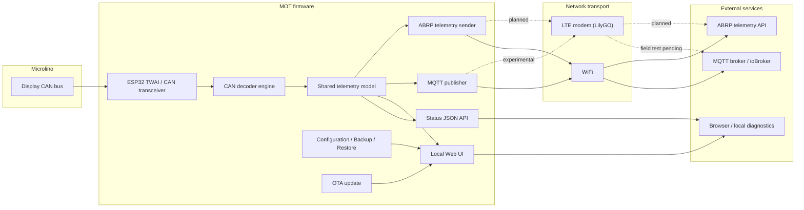

# Architecture Overview

Microlino Open Telemetry supports two firmware targets:

- ESP32-WROOM
- LilyGO T-A7670G R2

Both targets share the same core telemetry concepts:

```text
CAN frames
  -> decoder
  -> telemetry model
  -> Web UI / JSON API
  -> MQTT
  -> ABRP
```

## High-level architecture



## Shared concepts

- CAN input from the Microlino display CAN bus
- Shared telemetry model
- JSON status endpoints
- Web UI diagnostics
- MQTT publishing
- ABRP telemetry sender
- OTA update
- Configuration backup / restore

## Platform differences

| Area | ESP32-WROOM | LilyGO T-A7670G R2 |
|---|---|---|
| Network | WiFi | WiFi + LTE |
| GPS | none | external L76K GPS |
| CAN | ESP32 TWAI + transceiver | ESP32 TWAI + SN65HVD230 |
| ABRP location | ABRP/mobile-app fallback unless GPS exists | L76K GPS if valid |
| MQTT transport | WiFi | WiFi, LTE experimental |
| ABRP transport | WiFi | WiFi, LTE planned |
| OTA | Web OTA | Web OTA |

## Notes

- ABRP receives telemetry from the shared telemetry model.
- Latitude and longitude are included only when a valid GPS source exists.
- LilyGO MQTT over LTE is experimental until field-tested.
- LilyGO ABRP over LTE is planned, not yet final.
