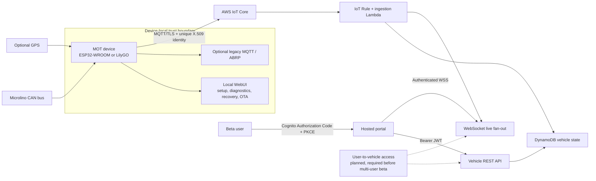
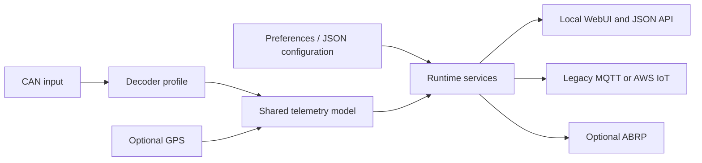

# System Architecture Overview

> **Status:** Current repository architecture
>
> **Audience:** Developer and maintainer
>
> **Last verified:** 2026-07-31; builds and deployed AWS state not revalidated

## Scope

MOT currently has two firmware targets: ESP32-WROOM and LilyGO T-A7670G. The
WeAct CAN485 board is a hardware option in the ESP32 family, not a third firmware
architecture. Both firmware targets assemble a shared telemetry pipeline and can
operate locally without the hosted portal.

## System boundaries

```mermaid
flowchart LR
    Vehicle["Microlino CAN bus"] --> Device["MOT device\nESP32-WROOM or LilyGO"]
    GPS["Optional GPS"] --> Device

    subgraph Local["Device-local trust boundary"]
      Device --> WebUI["Local WebUI\nsetup, diagnostics, recovery, OTA"]
      Device --> Legacy["Optional legacy MQTT / ABRP"]
    end

    Device -->|"MQTT/TLS + unique X.509 identity"| IoT["AWS IoT Core"]
    IoT --> Ingest["IoT Rule + ingestion Lambda"]
    Ingest --> State["DynamoDB vehicle state"]
    Ingest --> Live["WebSocket live fan-out"]

    User["Beta user"] -->|"Cognito Authorization Code + PKCE"| Portal["Hosted portal"]
    Portal -->|"Bearer JWT"| Api["Vehicle REST API"]
    Portal -->|"Authenticated WSS"| Live
    Api --> State

    Access["User-to-vehicle access\nplanned, required before multi-user beta"]
    Access -.-> Api
    Access -.-> Live
```

Solid edges are represented in the repository. Dotted authorization edges are the
next implementation boundary and are not yet enforced.

## Firmware pipeline

```mermaid
flowchart LR
    CAN["CAN input"] --> Decoder["Decoder profile"] --> Telemetry["Shared telemetry model"]
    GPS["Optional GPS"] --> Telemetry
    Config["Preferences / JSON configuration"] --> Services["Runtime services"]
    Telemetry --> Services
    Services --> LocalUI["Local WebUI and JSON API"]
    Services --> MQTT["Legacy MQTT or AWS IoT"]
    Services --> ABRP["Optional ABRP"]
```

## Platform differences

| Area | ESP32-WROOM | LilyGO T-A7670G |
|---|---|---|
| Reference network | WiFi | WiFi |
| Mobile network | Not available | LTE/GPRS present, not beta-ready |
| GPS | Optional external module | External L76K |
| CAN | ESP32 TWAI plus external transceiver/board | ESP32 TWAI plus external SN65HVD230 |
| AWS IoT | Implemented option | Implemented option over dependable network path |
| Local WebUI and OTA | Implemented | Implemented |

## Availability principle

Loss of AWS, the portal or Internet connectivity must not prevent device-local
configuration, diagnostics or recovery. Conversely, the local WebUI must not
become the hosted account or fleet-management system.

## Related documents

- [AWS IoT and portal](aws-iot.md)
- [Firmware overview](../firmware/overview.md)
- [Hardware comparison](../hardware/comparison.md)
- [Current status](../governance/CURRENT_STATUS.md)
