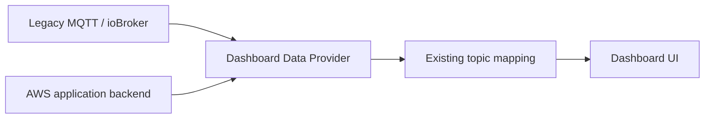

# AWS-2.3 dashboard data provider

## Goal

Separate dashboard rendering from the source of telemetry.



## Provider interface

A provider implements:

```javascript
{
  start({
    onConnection,
    onMessage,
    onError
  }),
  stop(),
  describe()
}
```

`onMessage(topic, payload)` intentionally matches MQTT.js, allowing the existing telemetry mapping to remain stable.

## Providers

### `legacy-mqtt`

Current functional provider:

- browser MQTT over WebSocket,
- persistent browser client ID,
- existing topic subscription,
- intended for development and self-hosted/debug operation.

### `aws-backend`

Target production provider:

- authenticated HTTPS snapshot,
- authenticated WebSocket live stream,
- no device certificate in the browser,
- user-to-vehicle authorization in the backend.

It is included as a contract/stub and remains inactive until the backend exists.

## Configuration

Current:

```javascript
dataSource: {
  type: "legacy-mqtt"
}
```

Future:

```javascript
dataSource: {
  type: "aws-backend"
},

awsBackend: {
  apiBaseUrl: "https://api.example.com",
  websocketUrl: "wss://api.example.com/ws/vehicles/{vehicleId}",
  reconnectPeriodMs: 5000,
  getAccessToken: async () => "user-access-token"
}
```

## Deliberate non-goal

The production browser does not connect directly to AWS IoT Core using device certificates. User identity and vehicle authorization belong in the application backend.
