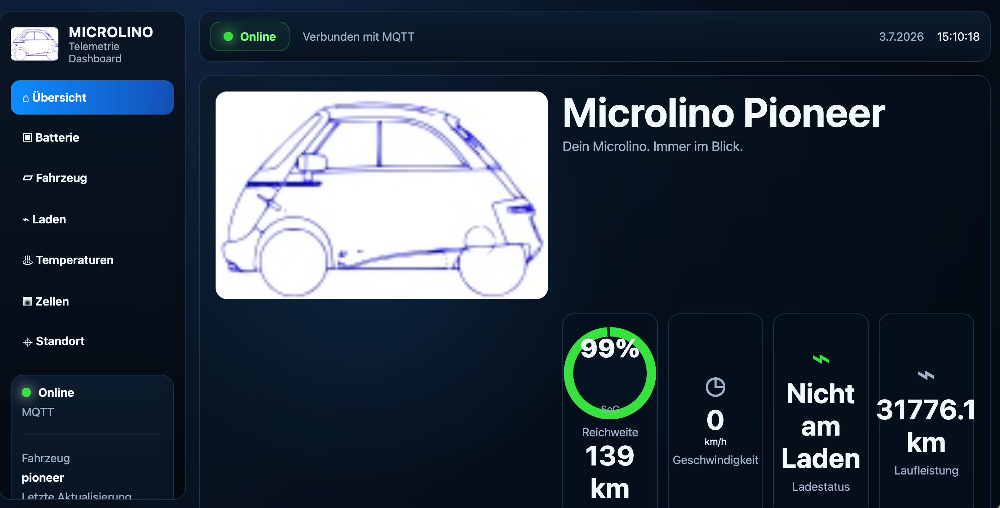

# Dashboard Overview

The dashboard provides current and live telemetry through the configured provider.
For the AWS backend it renders authorized SOC, Speed, signed-power, charging and
plugged history for 24 hours, 7 days and 30 days. Speed and power gaps are closed
at zero in the chart rather than linearly interpolated across missing reception.
Legacy MQTT retains browser-local history as a fallback.
AWS History is loaded on entry, range selection and actual vehicle changes rather
than on the five-second live-state poll. Concurrent same-range requests are
coalesced, stale responses are ignored, and a transient API failure leaves the
last successfully rendered charts visible with a warning.

The overview range card uses an automatic personal forecast when the backend has
enough valid distance/SOC evidence. The vehicle card explains the basis as driven
kilometres and journey count and retains the fixed `SOC × configured 100% range`
result as a comparison. Before valid history exists, the fixed value remains the
only displayed forecast. Both `/dashboard/` and `/motbeta/` consume this shared
portal source.

The backend derives the forecast from at most the ten newest valid journeys in
the last 30 days and stops adding older journeys after about 150 km. Charging,
odometer resets, implausible efficiency and very small segments are excluded.
Up to 100 km and 20 consumed SOC percentage points, the historical kilometres per
SOC point are progressively blended with the configured 140 km baseline; beyond
both evidence thresholds the personal value is used without baseline weighting.

The repository portal also renders the Standard-CAN BMS topics
`bms/pack_voltage`, `bms/pack_current`, `bms/pack_power_w` and the provisional
`bms/cell_min_mv`, `bms/cell_max_mv` and `bms/cell_delta_mv` values. The generic
AWS state and WebSocket path requires no schema deployment for these live fields.
This repository support does not mean the updated static portal package has been
uploaded to the hosted site. The portal labels the two `0x4AD` values as
cell-voltage candidates because their status as true pack-wide extrema is not yet
independently confirmed.

Following the controlled Pioneer road test, the portal also understands
`bms/vehicle_power_w`, `bms/is_regenerating` and `bms/is_discharging`. The battery
card uses consumption-positive vehicle power while raw pack power retains the
battery convention (positive into the pack). This prevents charging and
regeneration from being displayed with the traction sign.

On smartphone layouts, the leading charging card becomes a driving energy card
above 1 km/h. It then shows the same `Verbrauch`, `Rekuperation` or `Bereit`
power-flow state and vehicle-power magnitude as the battery detail card. At
standstill it continues to show `Nicht am Laden`, `Eingesteckt` or `Lädt`; desktop
layouts retain the charging card at all speeds.

The smartphone energy card adds a five-pixel live-power bar without increasing
the card height. Consumption uses a 0–20 kW scale with green through 3 kW, amber
through 10 kW and red above 10 kW. Regeneration also uses 0–20 kW, progressing
from light green through 5 kW to green through 10 kW and dark green above it.
Charging uses a finer 0–3.5 kW scale with light green through 1.6 kW, green through
2.4 kW and dark green above it. The bar appears only while charging or moving;
the numeric value and flow label remain the authoritative reading.

The live battery card presents charging power as a positive magnitude and changes
its label to `Ladeleistung` while charging. History uses a vehicle-facing signed
display: consumption is negative, while charging and regeneration are positive.
The chart uses a symmetric Y-axis and emphasized zero line and labels the newest
point with its power-flow direction. Consumption and regeneration within one
aggregation interval can partly cancel. The underlying signed vehicle-power topic
and stored History value remain positive for vehicle consumption and negative for
energy entering the battery; only the portal representation is inverted. Existing
records require no migration. The Speed chart marks its newest
measurement as not current after the expected sampling interval; this can mean
either standstill suppression or an offline device and is not by itself a
connectivity diagnosis.

Charging and plugged History share one binary chart. Charging is a solid purple
step line and cable connection a dashed pink step line. Each reported state is
held horizontally until its next reported state and changes only through a
vertical edge at that timestamp. Missing samples therefore never create a
misleading diagonal transition, and the two independently reported values remain
visible when they overlap.

On desktop, Battery and Vehicle use equal 180-pixel central instruments. Battery
places voltage, current, vehicle/charging power and power flow in a bounded 2×2
grid below its SoC ring, matching the Vehicle speedometer-plus-summary hierarchy
and preventing either instrument from crossing its card boundary. Smartphone
detail-card layout is unchanged by this desktop-only rule.

## Main views
- Home
- Battery
- Vehicle
- Charging
- Temperatures
- Cells
- Location

## Journey email preference

The notification settings include a separate, default-off opt-in for qualifying
journey summaries. It reuses the configured email channel and cannot be enabled
without that channel. The repository UI describes delivery for qualifying
journeys and notes that each email identifies either `Telemetrie-Schätzung` or
`Firmware-Zähler` as its energy source. Existing devices use the estimate path;
future firmware counters can take priority without changing the preference.

Journey completion normally follows ten minutes of stable standstill. For the
accepted Pioneer Standard-CAN decoder, a confirmed plug or charging signal is a
hard boundary that immediately seals the preceding drive; later legacy speed
noise cannot reopen it. The latest per-vehicle completion decision and exclusion
reason remain in backend diagnostics after active journey state is cleared.

If coverage disappears before the final speed or charging signal reaches AWS,
the backend finalizes the journey after 30 minutes without relevant telemetry.
It uses the last received signal as the endpoint and labels the email as a
telemetry timeout, so unobserved distance inside a garage is not presented as
measured journey data.
