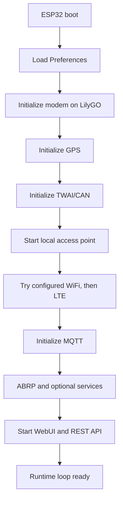
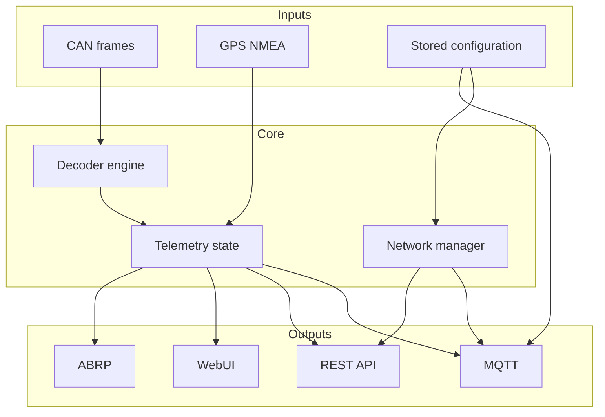

# Firmware architecture

## Boot sequence



The exact order differs slightly between platforms, but configuration, communications and local recovery access are initialized before normal telemetry publishing.

## Runtime components



## Shared telemetry model

Hardware-specific modules should not publish directly from raw input. They first update the shared telemetry model. This keeps MQTT, WebUI and future integrations independent from board-specific CAN or GPS implementations.

Typical groups are:

- `display`
- `charging`
- `location`
- `system`

## Platform separation

Shared definitions live under `firmware/common/`. Board-specific implementations live under:

```text
firmware/esp32-wroom/
firmware/lilygo-t-a7670/
```

This separation allows the decoder and topic model to remain common while network, modem, GPS and WebUI details can differ.
