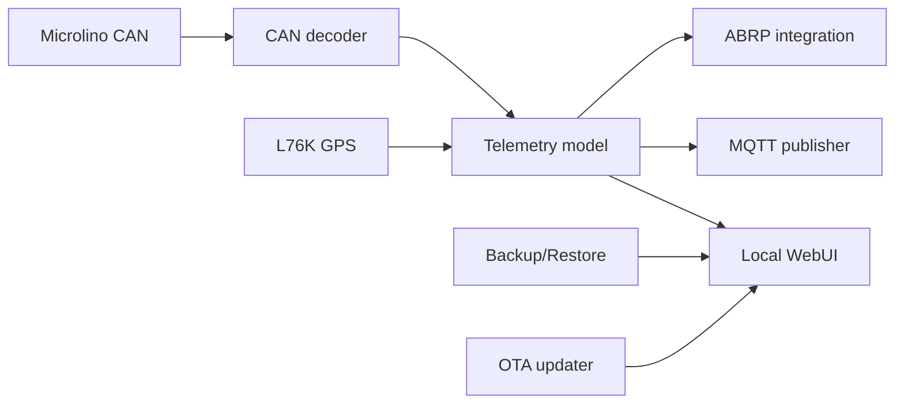

# Firmware architecture

## Modules

| Module | Responsibility |
|---|---|
| CAN | Receive CAN frames and diagnostics |
| GPS | Read L76K NMEA data |
| Telemetry | Normalize vehicle state |
| Network | WiFi/LTE selection |
| Modem | LilyGO A7670G modem stack |
| MQTT | Publish telemetry |
| WebUI | Local status/config/OTA |
| Config | Persistent settings and Backup/Restore |
| ABRP | Send telemetry to ABRP over WiFi currently |
