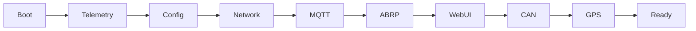
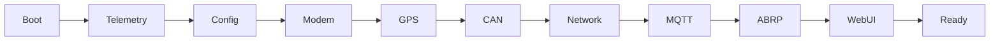
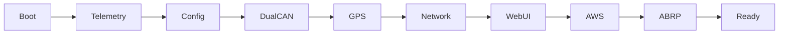
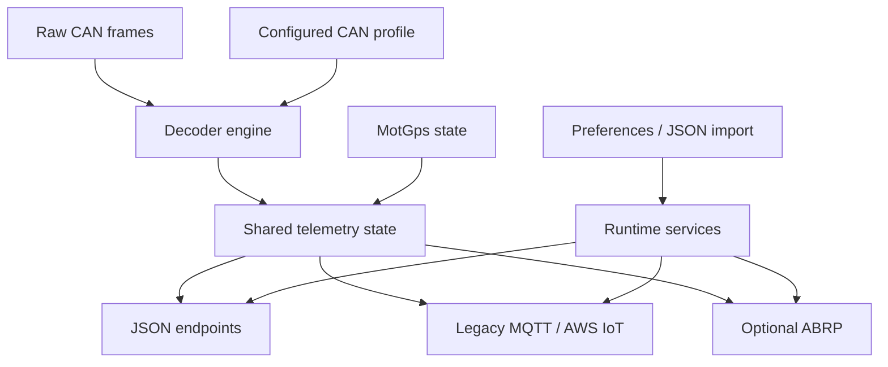

# Firmware Architecture

> **Status:** Confirmed from current source; runtime unverified
>
> **Audience:** Firmware developer and maintainer

## ESP32-WROOM startup order

```mermaid
flowchart LR
    Boot --> Telemetry --> Config --> Network --> MQTT --> ABRP --> WebUI --> CAN --> GPS --> Ready
```

## LilyGO startup order

```mermaid
flowchart LR
    Boot --> Telemetry --> Config --> Modem --> GPS --> CAN --> Network --> MQTT --> ABRP --> WebUI --> Ready
```

The sequence follows each target's `main.cpp`. Network modules start a local AP and
attempt configured connectivity within their own setup logic.

## ESP32-C6 startup order

```mermaid
flowchart LR
    Boot --> Telemetry --> Config --> DualCAN --> GPS --> Network --> WebUI --> AWS --> ABRP --> Ready
```

## Runtime loops

ESP32-WROOM processes CAN, GPS, MQTT, WebUI and ABRP, updates system telemetry each
second and publishes according to the configured interval.

LilyGO processes modem, network, GPS, MQTT, ABRP, WebUI and CAN on every loop,
updates system telemetry each second and yields with a short delay.

C6 services both TWAI controllers, GPS, dual-profile WiFi, WebUI, AWS and ABRP on
every loop. ABRP performs the bounded HTTPS request in a separate FreeRTOS task,
so a slow endpoint does not suspend CAN receive processing.

## Shared data path

```mermaid
flowchart TB
    CAN["Raw CAN frames"] --> Engine["Decoder engine"]
    Profile["Configured CAN profile"] --> Engine
    Engine --> Telemetry["Shared telemetry state"]
    GPS["MotGps state"] --> Telemetry
    Telemetry --> Json["JSON endpoints"]
    Telemetry --> MQTT["Legacy MQTT / AWS IoT"]
    Telemetry --> ABRP["Optional ABRP"]
    Config["Preferences / JSON import"] --> Runtime["Runtime services"]
    Runtime --> Json
    Runtime --> MQTT
    Runtime --> ABRP
```

## Decoder profiles

| Profile | Key | Implemented | Behaviour |
|---|---|---:|---|
| Display CAN | `display-can` | Yes | Decodes standard 11-bit frames `0x602`, `0x603`, `0x604` |
| Standard-CAN V1 - Pioneer | `standard-can-v1-pioneer` | No | Intentionally empty pending verified identifiers/scaling |
| Standard-CAN V2 | `standard-can-v2` | No | Intentionally empty pending verified identifiers/scaling |
| Disabled | `disabled` | Yes | Receives but does not decode frames |

The Display-CAN decoder derives SOC, speed, odometer, estimated range, charging
power/state and plugged state. Charging threshold and scaling comments show that
some values still require real-vehicle calibration; code presence is not signal
validation for other vehicle models.

## Platform separation

Common modules define telemetry contracts and reusable logic. Board-specific code
owns pins, modem/network behaviour, route registration and setup sequencing. The
two WebUI implementations expose overlapping but non-identical local APIs.

## Related documents

- [Firmware overview](overview.md)
- [CAN and decoder pipeline](can.md)
- [Local device API](../api/local-device-api.md)
