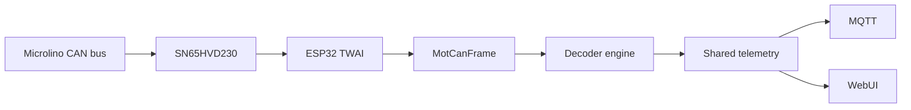

# CAN and decoder pipeline

MOT receives Microlino CAN traffic through the ESP32 TWAI controller and a CAN transceiver such as the SN65HVD230.

## Current bus settings

| Setting | Value |
|---|---|
| Bitrate | 500 kbit/s |
| CAN RX | GPIO32 |
| CAN TX | GPIO13 |
| Mode | Receive and diagnostics |
| Application frame transmission | Disabled |

## Pipeline

## Decoder scope

The first decoder work focused on values visible on the Microlino display, including:

- state of charge,
- speed,
- odometer,
- estimated range,
- charging state and power.

Future decoders may extend the telemetry model with BMS, cell-voltage and temperature data.

## Diagnostics

The CAN status API/WebUI should expose:

- driver ready state,
- RX/TX GPIO,
- bitrate,
- received standard/extended frames,
- bus errors,
- missed frames,
- last error.

A ready CAN controller with `framesRx = 0` usually means the vehicle is asleep, the interface is not attached, or CAN-H/CAN-L/ground is incorrect.
