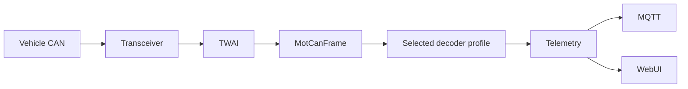

# CAN and Decoder Pipeline

> **Status:** Source-confirmed configuration; wiring and vehicle signals unverified
>
> **Audience:** Firmware developer and hardware reviewer

MOT uses the ESP32 TWAI controller in 500 kbit/s normal mode with an accept-all
filter. Application code reads received frames; no vehicle-control transmission
workflow is implemented.

## Board pin configuration

| Target | CAN RX | CAN TX | Source |
|---|---:|---:|---|
| ESP32-WROOM | GPIO27 | GPIO26 | `include/board_config.h`, PlatformIO flags |
| LilyGO T-A7670G | GPIO32 | GPIO13 | `include/board_config.h` |

Previous documentation incorrectly assigned GPIO32/13 to ESP32-WROOM. Physical
beta wiring must be checked against the actual board/transceiver before power-up.

## Pipeline

```mermaid
flowchart LR
    Bus["Vehicle CAN"] --> Transceiver --> TWAI --> Frame["MotCanFrame"]
    Frame --> Profile["Selected decoder profile"] --> Telemetry
    Telemetry --> MQTT
    Telemetry --> WebUI
```

## Implemented Display-CAN frames

Only standard frames with DLC at least 8 are decoded.

| CAN ID | Current decoded values |
|---:|---|
| `0x602` | SOC, speed, odometer and derived estimated range |
| `0x603` | charging power, signed power and derived charging state |
| `0x604` | plugged state |

Scaling and the charging threshold are present in code but must not be generalized
to other Microlino models without verified traces.

## Standard-CAN limitation

The `standard-can` profile is registered but intentionally has no decoder logic.
Its source explicitly waits for official identifiers and scaling. Selecting it must
not be described as support for another vehicle model.

## Hardware decision still open

Additional vehicle models may require rewiring the current module to standard CAN,
another CAN interface/transceiver, or a different MCU/board generation. This is a
backlog decision, not current firmware capability.

## Related documents

- [Firmware architecture](architecture.md)
- [Hardware comparison](../hardware/comparison.md)
- [Engineering backlog](../governance/ENGINEERING_BACKLOG.md)
