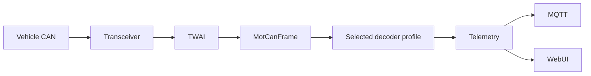

# CAN and Decoder Pipeline

> **Status:** Dual-CAN wiring and selected Pioneer Standard-CAN signals physically verified
>
> **Audience:** Firmware developer and hardware reviewer

MOT uses the ESP32 TWAI controller in 500 kbit/s normal mode with an accept-all
filter. Application code reads received frames; no vehicle-control transmission
workflow is implemented.

## Board pin configuration

| Target | CAN RX | CAN TX | Source |
|---|---:|---:|---|
| ESP32-WROOM | GPIO27 | GPIO26 | `include/board_config.h`, PlatformIO flags |
| LilyGO T-A7670G | GPIO32 | GPIO13 | `include/board_config.h` |

Previous documentation incorrectly assigned GPIO32/13 to ESP32-WROOM. Physical
beta wiring must be checked against the actual board/transceiver before power-up.

## Pipeline

```mermaid
flowchart LR
    Bus["Vehicle CAN"] --> Transceiver --> TWAI --> Frame["MotCanFrame"]
    Frame --> Profile["Selected decoder profile"] --> Telemetry
    Telemetry --> MQTT
    Telemetry --> WebUI
```

## Implemented Display-CAN frames

Only standard frames with DLC at least 8 are decoded.

| CAN ID | Current decoded values |
|---:|---|
| `0x602` | SOC, speed, odometer and derived estimated range |
| `0x603` | charging power, signed power and derived charging state |
| `0x604` | plugged state |

Scaling and the charging threshold are present in code but must not be generalized
to other Microlino models without verified traces.

External reverse-engineering notes provide this additional `0x603` map. The
source uses one-based byte and bit numbering; positions below are converted to
zero-based firmware indices and masks, assuming bit 1 is the least-significant
bit.

| Firmware position | Mask | Candidate meaning |
|---|---:|---|
| `data[1]` | `0x01` | seat-belt sensor/status |
| `data[2]` | `0x08` | handbrake |
| `data[2]` | `0x02` | parking/position light |
| `data[2]` | `0x04` | low beam |
| `data[3]` | `0x80` | D/R drive-interlock display message when brake was not pressed first |
| `data[3]` | `0x20`, `0x40` | indicator-state bits; left/right mapping not supplied |
| `data[4]` | full byte | dashboard power display |
| `data[5]` | `0x01` | sport mode |
| `data[6]` | `0x02` | brake pressed |

This evidence reinforces that `data[4]` is a bidirectional dashboard power-display
value, not by itself proof of active charging. The current threshold-derived
`charging.isCharging` and inferred sign logic remain provisional compatibility
behaviour and must be replaced or confirmed using controlled traces and an
independent plugged/charging signal.

## Standard-CAN profiles

`standard-can-v1-pioneer` now decodes the physically confirmed `0x18D` pack
voltage, current scale, derived power and plug/charge states. It also exposes the
observed but still provisional `0x4AD` cell pair. `standard-can-v2` has an
independent decoder implementation. Its initial `0x18D`/`0x4AD` rules preserve
the same evidence-backed pilot layout, but its constants and handlers are
separate so V2 validation can change them without affecting Pioneer vehicles.
The 0.3 A current scale, power sign and plug/charge interpretation remain
provisional on V2 until independently measured on that vehicle generation.

| CAN ID | Provisional Standard-CAN V2 values | Evidence status |
|---:|---|---|
| `0x18D` | bytes 3–4 little-endian pack voltage in mV; byte 7 SOC in % | Observed on Pioneer; independent reference still pending |
| `0x4AD` | bytes 0–1 and 2–3 little-endian cell voltages in mV; derived min/max/delta | Observed on Pioneer; independent reference still pending |

The full measurement table, plausibility boundary and AWS topic contract are in
[Pioneer Standard-CAN decoder](pioneer-standard-can.md).

The supplied Teltonika Flexi configuration also identifies four ordered payload
slots containing candidate current, pack/cell voltage, SOH, SOC and unknown BMS
parameters. It does not associate those slots with CAN identifiers or provide all
required scaling, so those fields are deliberately not decoded.

A passive Pioneer capture on 2026-08-05 confirmed that both candidate identifiers
occur on Standard CAN. Repeated `0x18D` decoding produced approximately
53.020–53.059 V and 90% SOC; `0x4AD` produced 4,081/4,078 mV with a 3 mV delta.
These values are internally plausible and strongly support the proposed byte
order and units. They do not yet establish equality with Display-CAN SOC, accuracy
against an external measurement or applicability to another Microlino model.

A subsequent controlled Pioneer charging sequence separated wake, plug and active
charge states:

| State | `0x18D data[1..2]` signed LE | `data[6]` | Pack-voltage observation |
|---|---:|---:|---:|
| awake, unplugged | `FC FF` = -4 | `0x10` | approximately 53.0 V |
| plugged, not charging | `FC FF` = -4 | `0x20` | approximately 53.0 V |
| charging, 1,836 W measured AC input | about `70 00`–`76 00` = 112–118 | `0x20` | approximately 53.30–53.42 V |
| external AC removed, cable retained | `FC FF` = -4 | `0x20` | approximately 53.16 V then settling |

This strongly supports `data[6] & 0x20` as a plugged candidate and signed
little-endian `data[1..2]` as a charge-current or charge-power candidate. One
measured power level is insufficient to assign a physical scale. `data[0]`
covered nearly its full byte range during stable charging and is likely a rolling
counter or sequence value rather than the measurement itself.

During the same Pioneer capture, `0x101`, `0x107`, `0x1B0`, `0x1B1` and `0x2BA`
were not observed. `0x37F` was present but constant in the stationary test.

A second stable point was captured during charge taper at 98% Display-CAN SOC:
the charger measured 762 W gross AC input while signed `data[1..2]` ranged from
43 to 47 and pack voltage was approximately 53.2 V. Together with the earlier
1,836 W point at raw 112–118, both observations strongly support a provisional
scale of 0.3 A per raw unit:

- raw 115 × 0.3 A × 53.3 V ≈ 1,839 W DC;
- raw 45 × 0.3 A × 53.2 V ≈ 718 W DC versus 762 W measured AC input.

The remaining difference is plausible conversion loss and vehicle consumption.
Direct power at roughly 16 W per raw unit is numerically similar at this pack
voltage, but subsequent lower-SOC measurements at several charge settings matched
`raw × 0.3 A × pack voltage` to independent power references. The 0.3 A/unit
charging scale is therefore confirmed for Pioneer. During the 98% display reading, `0x18D data[7]` remained
90, proving that it is not Pioneer Display-CAN SOC even though an external V2
source identifies that byte as Display SOC on the other model.

At natural charge completion the displayed SOC reached 100%, measured AC input
fell to 0 W and the display switched off. Over the captured transition,
`data[1..2]` moved from `2D 00` (+45) to `FD FF` (-3) and remained stably -3 for
the following ten seconds. `data[6]` stayed `0x20` with the cable retained, while
`data[7]` stayed 90. This confirms that active charging can be distinguished from
plugged-idle using the signed current candidate and that a small negative idle
offset around -3/-4 must not be classified as discharge or charging.

A separate plug test with the mobile charger AC-side unpowered changed `data[6]`
from `0x10` unplugged to `0x20` plugged. The byte therefore reflects physical plug
presence without requiring an energized EVSE. Brief `0x04` transition values were
observed during connect/disconnect and must not be treated as stable states.

## External Standard-CAN V2 candidate map

Screenshots supplied from a separate V2 reverse-engineering effort identify the
following additional standard identifiers. Byte positions below are zero-based;
the source spreadsheet numbers them from one. They are discovery targets, not yet
active MOT decoder fields.

| CAN ID | Candidate bytes | Candidate meaning | Missing evidence |
|---:|---|---|---|
| `0x101` | byte 4 | positive power request | full label, unit and scaling |
| `0x1B0` | bytes 2–3 | pack voltage in mV | byte order |
| `0x1B0` | bytes 4–5 | minimum cell voltage in mV | byte order |
| `0x1B0` | bytes 6–7 | maximum cell voltage in mV | byte order |
| `0x1B1` | bytes 0–1 | SOC ×100 | byte order and live comparison |
| `0x1B1` | bytes 2–3 | SOH ×100 | byte order and live comparison |
| `0x2BA` | bytes 0–1 | battery current, likely scaled by 10 | signedness, byte order and exact unit |
| `0x37F` | bytes 2–3 | accelerator/power-pedal value | signedness, byte order, unit and scaling |

The accompanying Teltonika screen shows example converted values including
49,770 mV pack voltage, 3,819/3,847 mV cell extrema, raw SOC 5,254 and raw SOH
9,703. Those examples support `/100` interpretation for SOC/SOH, but the visible
Flexi conversion block orders its three `manual.can.hex.2` values as max cell,
min cell and pack voltage while the spreadsheet orders the `0x1B0` payload as
pack, min and max after two leading zero bytes. The missing Teltonika manual-CAN
slot configuration is therefore required before equating `hex.0..3` directly
with these CAN identifiers.

## Hardware decision

The bounded C6-001 result selects the nanoESP32-C6-N16 with two external
transceivers as the dual-CAN WiFi pilot path. WROOM and LilyGO remain supported
single-CAN alternatives. A second CAN bus on the classic-ESP32 LilyGO would require
an SPI controller such as MCP2515 and a new, physically verified pin plan; it is
not part of the current firmware capability.

## Related documents

- [CAN signal matrix — formatted PDF](can-signal-matrix.pdf)
- [CAN signal matrix — editable RTF source](can-signal-matrix.rtf)
- [Pioneer Standard-CAN decoder and charge evidence](pioneer-standard-can.md)
- [Firmware architecture](architecture.md)
- [Hardware comparison](../hardware/comparison.md)
- [Engineering backlog](../governance/ENGINEERING_BACKLOG.md)
