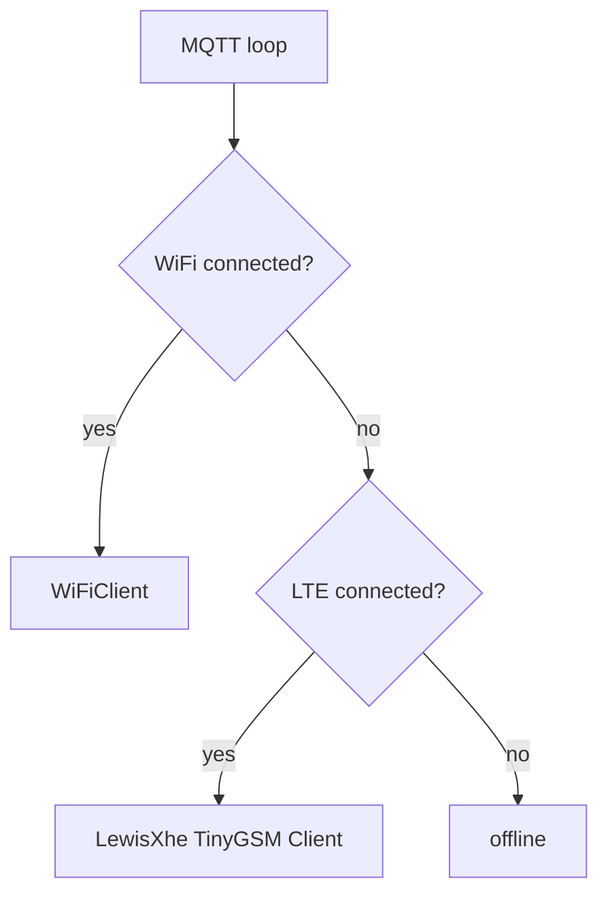

# MQTT

MOT publishes telemetry through MQTT over WiFi or LTE.

```mermaid
flowchart TD
    A[MQTT loop] --> B{WiFi connected?}
    B -->|yes| C[WiFiClient]
    B -->|no| D{LTE connected?}
    D -->|yes| E[LewisXhe TinyGSM Client]
    D -->|no| F[offline]
```

Future work: device heartbeat/LWT for true Microlino online state.
