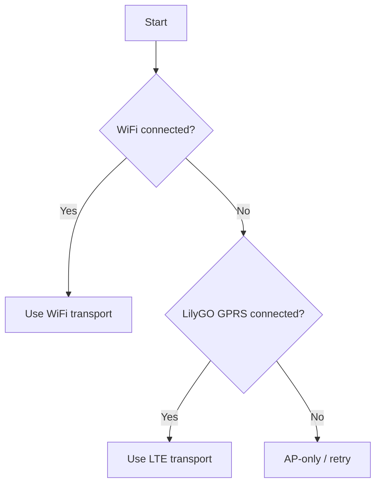

# Network management

## Interfaces

The firmware can expose or use these interfaces:

- Local setup access point.
- WiFi station connection.
- LTE packet-data connection on LilyGO.

## Priority

The intended LilyGO priority is:

1. Use configured WiFi when connected.
2. Use LTE when WiFi is unavailable and GPRS/PDP is ready.
3. Keep the setup AP available during development and recovery.

## Documented retry behavior

Earlier failover work documented:

- WiFi loss grace: 20 seconds.
- WiFi retry while on LTE: 60 seconds.
- LTE retry while unavailable: 15 seconds.

These values should be verified against the current source before being treated as a public API guarantee.

## Access point

The AP provides a recovery path when station credentials are invalid or unavailable. Security hardening for the AP and local WebUI is planned for a dedicated security sprint.

## LTE status

Validated at the modem/network layer:

- modem initialization,
- SIM/network registration,
- GPRS/PDP attachment,
- provider-assigned IP,
- DNS and TCP opening.

MQTT receive/CONNACK handling over LTE remains experimental.
