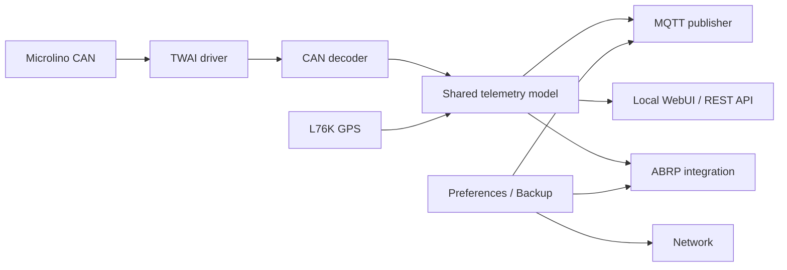

# Firmware overview

Microlino Open Telemetry (MOT) uses a shared telemetry model across two ESP32 firmware families:

- **ESP32-WROOM** for WiFi-based CAN telemetry.
- **LilyGO T-A7670G** for WiFi, LTE development and external L76K GPS.

The firmware receives vehicle and location data, normalizes it into a common model and exposes that state through MQTT, the local WebUI and REST status endpoints.

## Responsibilities

| Subsystem | Responsibility |
|---|---|
| CAN | Receive Microlino CAN frames and maintain diagnostics |
| Decoder | Convert raw frames into normalized vehicle values |
| Telemetry | Shared state used by MQTT, WebUI and integrations |
| GPS | Read and validate L76K location data |
| Network | Manage AP, WiFi and LilyGO LTE availability |
| MQTT | Publish retained telemetry and system values |
| WebUI | Local configuration, status, OTA and recovery |
| Configuration | Store settings in ESP32 Preferences/NVS |
| ABRP | Build and send optional route-planning telemetry |
| OTA | Update firmware through the local WebUI |

## Data flow

## Platform status

| Function | ESP32-WROOM | LilyGO T-A7670G |
|---|---:|---:|
| CAN receive | Stable | Working |
| WiFi MQTT | Stable | Working |
| Local WebUI | Stable | Working |
| OTA | Stable | Working |
| Backup/Restore | Stable | Working |
| GPS | Optional | Working with L76K |
| LTE registration/GPRS | — | Working |
| MQTT over LTE | — | Experimental |
| ABRP over LTE HTTPS | — | Deferred |

The WiFi path is the current reference for end-to-end validation. Detailed LTE investigations are kept under `docs/developer/lte/`.
