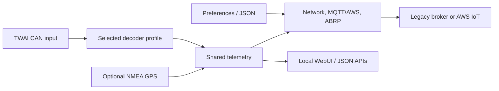

# Firmware Overview

> **Status:** Confirmed in source structure; build and hardware behaviour unverified
>
> **Audience:** Developer, maintainer and beta-support author
>
> **Evidence date:** 2026-08-02

## Firmware targets

MOT contains two board-specific applications sharing common telemetry, decoder,
configuration, AWS IoT and GPS components:

- `firmware/esp32-wroom/`
- `firmware/lilygo-t-a7670/`

The WeAct ESP32 CAN485 is a hardware/transceiver option in the ESP32 family, not a
third application target in the repository.

## Declared PlatformIO environments

| Environment | Source meaning | DOC-001 status |
|---|---|---|
| `esp32dev` | ESP32-WROOM with legacy plain MQTT path | Legacy build structure |
| `esp32dev-aws` | ESP32-WROOM with LittleFS and `MOT_AWS_IOT=1` | Intended maintained AWS variant |
| `esp32dev-gps-test` | Standalone GPS diagnostic main | Retired product variant; historical test utility |
| `lilygo-t-a7670` | LilyGO with legacy WiFi/LTE MQTT path | Legacy build structure |
| `T-A7670X-AWS` | LilyGO with LittleFS and `MOT_AWS_IOT=1` | Intended maintained AWS variant; AWS transport is WiFi-only |

The target maintenance model is one firmware line per board, with AWS IoT and GPS
as capabilities rather than generations. PlatformIO has not yet been simplified;
DOC-001 documents the discrepancy but does not change firmware configuration.

## Shared components

| Path | Responsibility |
|---|---|
| `firmware/common/telemetry` | Normalized display, charging, location and system state |
| `firmware/common/decoders` | Decoder registry, Display-CAN decoder and empty Standard-CAN template |
| `firmware/common/config` | Configuration contract, keys and readiness model |
| `firmware/common/api` | Shared telemetry JSON |
| `firmware/common/abrp` | Optional ABRP client |
| `firmware/common/system` | Version and stable device identity helpers |
| `firmware/shared-libs/MotAwsIot` | X.509 MQTT/TLS, presence, heartbeat and telemetry publishing |
| `firmware/shared-libs/MotGps` | NMEA parsing and detected/fix state |

## Runtime assembly

Both targets initialize configuration, networking, CAN/GPS, MQTT/AWS, local WebUI
and optional ABRP, then update the shared telemetry state in their main loop.
Board-specific modules still own their transport and WebUI implementations.

```mermaid
flowchart LR
    CAN["TWAI CAN input"] --> Decoder["Selected decoder profile"] --> Telemetry["Shared telemetry"]
    GPS["Optional NMEA GPS"] --> Telemetry
    Config["Preferences / JSON"] --> Services["Network, MQTT/AWS, ABRP"]
    Telemetry --> Services
    Telemetry --> Local["Local WebUI / JSON APIs"]
    Services --> Cloud["Legacy broker or AWS IoT"]
```

## Source-confirmed capability matrix

“Present” means code/configuration exists; it does not mean the current commit has
been built or tested on hardware.

| Capability | ESP32-WROOM | LilyGO T-A7670G |
|---|---|---|
| TWAI receive at 500 kbit/s | Present, RX 27/TX 26 | Present, RX 32/TX 13 |
| Display-CAN decoder | Shared, implemented | Shared, implemented |
| Standard-CAN decoder | Shared empty template | Shared empty template |
| WiFi and open fallback/setup AP | Present | Present |
| Local WebUI/config/readiness | Present | Present |
| Local browser OTA | Present | Present |
| Optional GPS | UART RX 16/TX 17 | L76K UART RX 22/TX 21 |
| AWS IoT X.509 | `esp32dev-aws`, WiFi | `T-A7670X-AWS`, WiFi only |
| Legacy MQTT | WiFi | WiFi with LTE candidate/fallback path |
| LTE/GPRS | Not applicable | Modem/network code present; beta readiness unverified |
| ABRP | Present | Present; transport status requires validation |

## Security boundary

The firmware local WebUI and APIs have no application authentication in current
source. Both network implementations start an open AP (`WiFi.softAP` without a
password). The local interface must not be exposed to the public Internet. Beta
provisioning and support procedures must account for physical proximity and local
network access until a separate device-local security decision is implemented.

Portal accounts and device ownership do not belong in this local WebUI.

## Validation boundary

DOC-001 has not compiled these environments or tested CAN, GPS, WiFi, LTE, MQTT,
AWS, OTA or WebUI on hardware. Historical tests remain history until repeated
against an exact current commit.

## Related documents

- [Firmware architecture](architecture.md)
- [Local device API](../api/local-device-api.md)
- [MQTT topics](../api/mqtt-topics.md)
- [Hardware comparison](../hardware/comparison.md)
- [Current status](../governance/CURRENT_STATUS.md)
