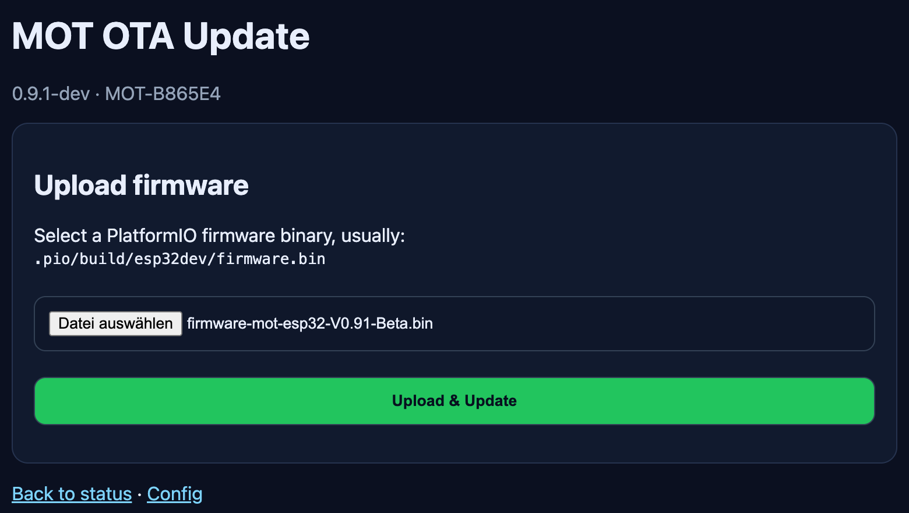

# OTA Updates

OTA allows firmware updates without physical USB access.

## Recommended process
1. Build firmware.
2. Open `http://<esp-ip>/update`.
3. Enter OTA password.
4. Upload `.bin`.
5. Wait for reboot.
6. Verify firmware version and MQTT.
