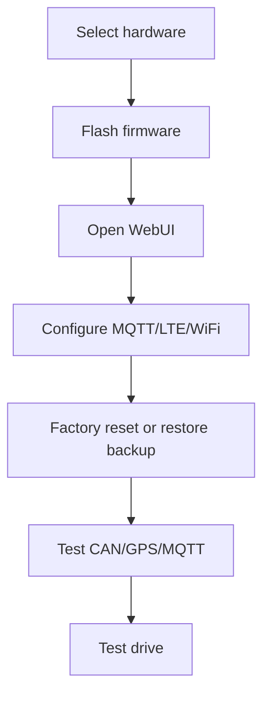

# Getting started

## Choose your hardware

| Goal | Recommended hardware |
|---|---|
| WiFi-only telemetry | ESP32-WROOM + SN65HVD230 |
| Compact CAN board | WeAct Studio ESP32 CAN485 |
| LTE telemetry | LilyGO T-A7670G |

## Basic setup flow

