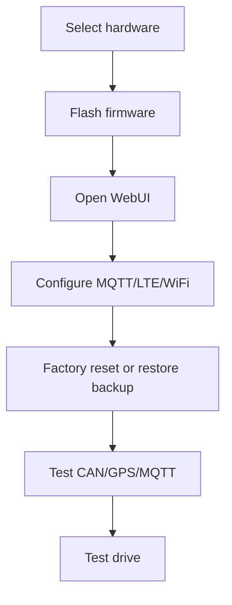

# Getting started

> **Status:** Unverified legacy-oriented overview; use the beta guide for WROOM handoff
>
> **Audience:** Evaluator and beta provisioner

For the intended AWS beta, begin with the
[ESP32-WROOM beta guide](../beta/esp32-wroom-guide.md). The flow below predates the
current provisioning and release gates.

## Choose your hardware

| Goal | Recommended hardware |
|---|---|
| WiFi-only telemetry | ESP32-WROOM + SN65HVD230 |
| Compact CAN board | WeAct Studio ESP32 CAN485 |
| LTE telemetry | LilyGO T-A7670G |

## Basic setup flow

```mermaid
flowchart TD
    A[Select hardware] --> B[Flash firmware]
    B --> C[Open WebUI]
    C --> D[Configure MQTT/LTE/WiFi]
    D --> E[Factory reset or restore backup]
    E --> F[Test CAN/GPS/MQTT]
    F --> G[Test drive]
```
