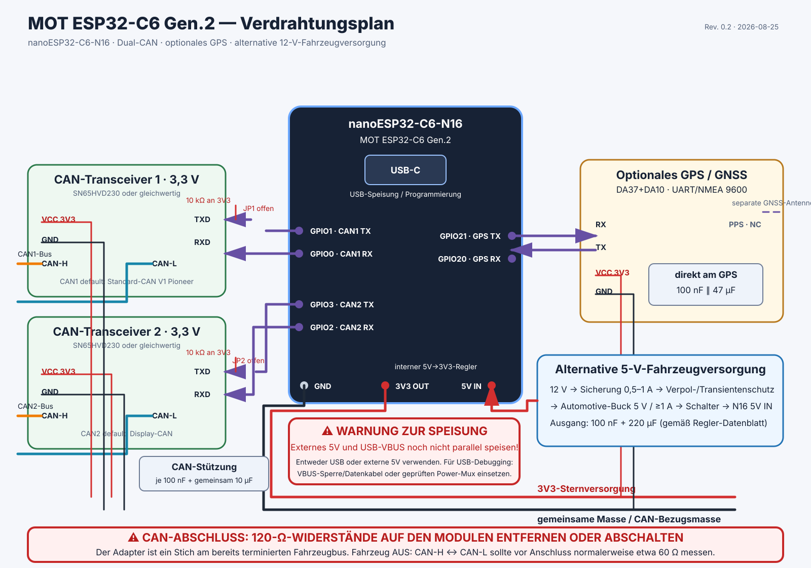

# MOT ESP32-C6 Gen.2 – Pilot-Aufbau

> **Status:** Aufbauunterlage für hardwareaffine Pilotnutzer; keine
> Serienfreigabe oder fahrzeugseitige Zulassung
>
> **Zielhardware:** nanoESP32-C6-N16 mit zwei 3,3-V-CAN-Transceivern und
> optionalem ATGM336H-5N-GPS

Diese Anleitung ist so ausgelegt, dass ein Pilot den Adapter auch ohne Betreuung
vor Ort aufbauen und elektrisch vorprüfen kann. Sie setzt sicheres Löten,
Multimeterkenntnisse und einen sorgfältigen Umgang mit der Fahrzeugelektrik
voraus. Bei Unsicherheit den Adapter nicht mit dem Fahrzeug verbinden.

> **Wichtig:** Der Plan endet bewusst an `CAN1 bus`, `CAN2 bus` und
> `Fahrzeug-Signalmasse`. Die fahrzeugseitige Stecker-/OBD-Pinbelegung muss für
> Fahrzeugmodell und Adapterkabel separat freigegeben werden. Niemals eine
> vermutete OBD-Belegung anhand dieses Plans anschließen.

[Druckfähiges Dual-TWAI-Verdrahtungsdiagramm (PDF)](../assets/pdfs/hardware/nanoesp32-c6-n16-dual-twai-verkabelung.pdf)

## Benötigte Teile

| Anzahl | Bauteil | Mindestanforderung |
|---:|---|---|
| 1 | nanoESP32-C6-N16 | 16 MB Flash, USB-C |
| 2 | CAN-Transceivermodul | 3,3 V, z. B. SN65HVD230; 120 Ω entfernbar/abschaltbar |
| 1 | GPS/GNSS-Modul, optional | ATGM336H-5N, 3,3 V, UART 9600 Baud, Antenne |
| 3 | Keramikkondensator | 100 nF, mindestens 10 V |
| 1 | Stützkondensator CAN | 10 µF, mindestens 6,3 V |
| 1 | Stützkondensator GPS | 47 µF, mindestens 6,3 V |
| 1 | Zentraler Pufferkondensator | ungefähr 220 µF, mindestens 6,3 V |
| 1 | 12-V-Step-down, optional | Automotive-tauglich, 5 V stabilisiert, mindestens 1 A |
| 1 | Eingangssicherung, optional | 0,5–1 A, nahe an der 12-V-Abzweigung |
| 1 | Eingangsschutz, optional | Verpolschutz und geeigneter Fahrzeug-Transientenschutz |
| — | Leitungen/Steckverbinder | CAN paarweise verdrillt, zugentlastet, berührungssicher |

Elektrolytkondensatoren sind gepolt: Plus an 3V3, Minus an GND. Die
Spannungsfestigkeit allein macht einen Step-down noch nicht automotive-tauglich.

## Pin-zu-Pin-Verdrahtung

| Funktion | Anschluss N16 | Anschluss Modul |
|---|---:|---|
| CAN1 empfangen | GPIO0 | CAN1 RXD |
| CAN1 senden, optional | GPIO1 | Über offenen TX-Enable-Jumper an CAN1 TXD |
| CAN2 empfangen | GPIO2 | CAN2 RXD |
| CAN2 senden, optional | GPIO3 | Über offenen TX-Enable-Jumper an CAN2 TXD |
| GPS empfangen | GPIO20 | GPS TX |
| GPS senden | GPIO21 | GPS RX |
| GPS-Zeitimpuls | nicht anschließen | GPS PPS offen lassen |
| Versorgung | 3V3 | VCC beider CAN-Module und GPS VCC |
| Fahrzeugversorgung, optional | 5V | Ausgang des geschützten 12-V→5-V-Wandlers |
| Bezugsmasse | GND | GND beider CAN-Module, GPS und Fahrzeug-Signalmasse |

RX und TX werden nur beim GPS gekreuzt: N16-RX erhält GPS-TX und N16-TX geht an
GPS-RX. CAN-RXD wird direkt mit dem jeweiligen N16-RX verbunden. CAN-TXD bleibt
im normalen Pilotbetrieb vom N16 getrennt, wird am Transceiver definiert auf 3,3 V
gehalten und darf nur über einen bewusst geschlossenen TX-Enable-Jumper mit dem
jeweiligen N16-TX verbunden werden. Details und Bauteilwerte stehen in
[CAN receive-only hardware design](can-receive-only-design.md).

Nur 3,3-V-CAN-Transceiver wie SN65HVD230 oder nachweislich gleichwertige Module
verwenden. Übliche 5-V-TJA1050-/MCP2551-Breakouts sind kein direkter Ersatz.

Die Standardkonfiguration ist CAN1 = Standard-CAN V1 Pioneer und CAN2 =
Display-CAN. Die Firmware kann grundsätzlich jeden registrierten Decoder einem
der beiden Controller zuweisen.

## CAN-Abschluss – vor dem Einbau zwingend prüfen

Der MOT-Adapter wird als kurzer Stich an Fahrzeugbusse angeschlossen, die an den
beiden physischen Enden bereits terminiert sind. Fest montierte
120-Ω-Widerstände günstiger CAN-Breakouts müssen daher normalerweise auf
**beiden** Transceivermodulen entfernt oder deaktiviert werden.

Bei ausgeschaltetem Fahrzeug und vor Anschluss des MOT misst ein korrekt an zwei
Enden terminierter Bus zwischen CAN-H und CAN-L üblicherweise ungefähr 60 Ω. Ein
dritter 120-Ω-Widerstand würde den Wert auf ungefähr 40 Ω reduzieren. Diese
Messung ist ein Plausibilitätscheck, keine universelle Fahrzeugfreigabe. Niemals
bei versorgtem Bus Widerstände ein- oder auslöten.

CAN-H und CAN-L jedes Busses als Paar verdrillen und den Stich möglichst kurz
halten. CAN1 und CAN2 dürfen außer der gemeinsamen Bezugsmasse nicht miteinander
verbunden werden. CAN-H und CAN-L nicht zwischen den beiden Bussen vertauschen.

## Stützkondensatoren und Versorgung

- Je 100 nF direkt zwischen VCC und GND jedes CAN-Transceivers platzieren.
- Einen gemeinsamen 10-µF-Kondensator nahe bei den zwei CAN-Modulen ergänzen.
- Am GPS-Stecker 100 nF parallel zu 47 µF vorsehen.
- Am zentralen 3,3-V-Verteiler ungefähr 220 µF plus 100 nF vorsehen; dabei die
  Stabilitäts- und Kapazitätsgrenzen des gewählten Reglers einhalten.
- 3V3 und GND sternförmig verteilen. Den GPS-Strom nicht durch ein CAN-Modul
  führen.

## Betriebsart der Stromversorgung auswählen

Für Aufbau und Pilotbetrieb kann USB-C den N16 über dessen Onboard-Regler speisen.
Für einen Festeinbau ist ein abgesicherter, verpolungs- und transientengeschützter
Automotive-Wandler von 12 V auf 5 V mit mindestens 1 A vorgesehen. Dessen Ausgang
wird über einen Schalter an den `5V`-Eingang des N16 geführt. Der interne Regler
des N16 erzeugt daraus die gemeinsame 3,3-V-Versorgung für ESP32, beide
CAN-Module und GPS. Nicht direkt vom Fahrzeug-Step-down in `3V3` einspeisen.

**Externes 5V und USB-VBUS bis zur abgeschlossenen Rückstromprüfung niemals direkt
parallel speisen.** Auch nominell gleiche 5-V-Quellen können gegeneinander oder
zum USB-Host zurückspeisen. Genau eine Quelle verwenden:

- **USB-Betrieb:** Externen 5-V-Wandler ausschalten oder physisch trennen.
- **12-V-Betrieb:** USB abziehen.
- **12-V-Betrieb mit USB-Daten:** Erst nach separater Freigabe; dafür einen
  geprüften VBUS-Blocker/Datenadapter oder eine konstruierte
  Power-Mux-/Ideal-Dioden-Schaltung verwenden.

Die 12-V-Eingangsstufe muss den tatsächlichen Spannungsbereich und die Transienten
des Fahrzeugnetzes vertragen. Ein generischer Indoor-Buck ist nicht automatisch
automotive-tauglich.

## Prüfung vor dem ersten Fahrzeuganschluss

Alle Prüfungen zunächst ohne Verbindung zu CAN1, CAN2 oder Fahrzeug-12-V:

1. Sichtprüfung auf Lötbrücken, lose Litzen, falsche Polarität und fehlende
   Zugentlastung durchführen.
2. Im spannungslosen Adapter zwischen 3V3 und GND auf Kurzschluss prüfen. Ein
   kurzer Ladeeffekt der Kondensatoren ist möglich; ein dauerhaft annähernd
   null Ohm messender Pfad ist nicht zulässig.
3. Den Adapter nur über USB einschalten. Prüfen, dass N16, beide CAN-Module und
   optional GPS versorgt werden und nichts ungewöhnlich warm wird.
4. 3V3 gegen GND messen. Erwartet werden ungefähr 3,3 V; bei deutlich
   abweichendem Wert sofort trennen.
5. Fahrzeug vollständig ausschalten. Jeden vorgesehenen CAN-Bus getrennt
   zwischen CAN-H und CAN-L messen und den ungefähr 60-Ω-Plausibilitätswert
   dokumentieren.
6. Zuerst GND und genau einen CAN-Bus verbinden. Fahrzeug/Bus aktivieren und in
   der lokalen MOT-Diagnose den Empfang kontrollieren. Danach ausschalten und
   erst den zweiten Bus ergänzen.
7. GPS im Freien testen. `detected` bestätigt nur die UART-Erkennung; gültige
   Koordinaten setzen einen Satelliten-Fix voraus.
8. Erst nach bestandenem USB-Test die optionale 12-V→5-V-Versorgung separat am
   `5V`-Eingang testen. Vor erneutem Anschluss von USB muss der externe 5-V-Pfad
   getrennt sein.

## Rückmeldung bei einem entfernten Pilotaufbau

Vor der ersten Fahrt sollten mindestens folgende Nachweise festgehalten werden:

- Foto der Ober- und Unterseite des fertigen Aufbaus;
- Foto oder Bestätigung der entfernten/deaktivierten 120-Ω-Widerstände;
- gemessene 3V3-Spannung;
- Widerstand CAN-H gegen CAN-L für CAN1 und CAN2 bei ausgeschaltetem Fahrzeug;
- lokale Diagnose mit CAN1-/CAN2-Zähler sowie GPS-Status;
- verwendete Versorgungsart und genaue Bezeichnung des Step-down-Moduls.

Bei Rauch, Geruch, ungewöhnlicher Erwärmung, Neustartschleifen, CAN-Fehlern oder
einem Widerstandswert deutlich außerhalb der Erwartung: sofort spannungslos
machen, nicht weiterfahren und Fotos sowie Messwerte zur Prüfung weitergeben.
