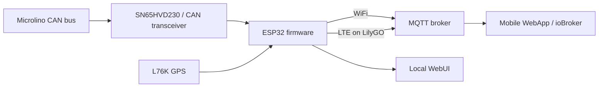

# Hardware overview

Microlino Open Telemetry supports several ESP32-based hardware variants: a classic ESP32-WROOM setup, the compact WeAct Studio ESP32 CAN485 board, and the LTE-capable LilyGO T-A7670G.

## Supported platforms

| Platform | CAN | WiFi | LTE | GPS | Recommended use |
|---|---:|---:|---:|---:|---|
| ESP32-WROOM + SN65HVD230 | Yes | Yes | No | Optional | Development, garage and WiFi telemetry |
| WeAct Studio ESP32 CAN485 | Yes | Yes | No | Optional | Compact WiFi CAN telemetry |
| LilyGO T-A7670G | Yes | Yes | Experimental | L76K | Mobile telemetry and LTE development |

## Which hardware should I choose?

| Goal | Recommended hardware |
|---|---|
| Lowest cost and easiest debugging | ESP32-WROOM + SN65HVD230 |
| Compact CAN hardware | WeAct Studio ESP32 CAN485 |
| Telemetry while driving without hotspot | LilyGO T-A7670G |
| Best current field-test stability | WiFi or phone hotspot path |
| LTE development | LilyGO T-A7670G |

## High-level architecture

## Verified hardware matrix

| Hardware | Status | Notes |
|---|---:|---|
| ESP32-WROOM + SN65HVD230 | Verified | Reference WiFi/CAN baseline |
| WeAct Studio ESP32 CAN485 | Compatible | Same CAN GPIO mapping |
| LilyGO T-A7670G + L76K | In progress | WiFi verified; LTE MQTT remains experimental |
| L76K GPS | Verified | Valid GPS fix and location telemetry |
| Microlino Pioneer | Verified | Project vehicle for field tests |
