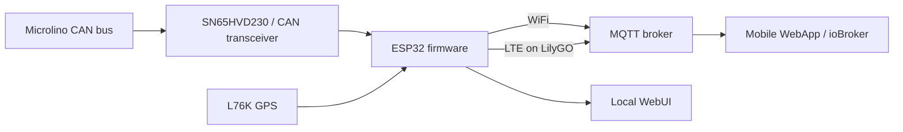

# Hardware overview

> **Status:** Bounded WROOM/LilyGO/N16 field evidence; production handoff still requires review
>
> **Audience:** Evaluator, beta provisioner and hardware maintainer

Microlino Open Telemetry supports several ESP32-based hardware variants: a classic ESP32-WROOM setup, the compact WeAct Studio ESP32 CAN485 board, and the LTE-capable LilyGO T-A7670G.

The Muse Lab nanoESP32-C6-N16 has completed a bounded dual-CAN WiFi/AWS pilot
qualification. It is not yet a production-approved custom MOT module.

The current remote-pilot assembly and validation reference is documented in
[MOT ESP32-C6 Gen.2 pilot assembly](mot-esp32-c6-gen2-wiring.md).

## Supported platforms

| Platform | CAN | WiFi | LTE | GPS | Recommended use |
|---|---:|---:|---:|---:|---|
| ESP32-WROOM + SN65HVD230 | Yes | Yes | No | Optional | Development, garage and WiFi telemetry |
| WeAct Studio ESP32 CAN485 | Yes | Yes | No | Optional | Compact WiFi CAN telemetry |
| LilyGO T-A7670G | Two in active pilot | Yes | Functional pilot path | L76K | Mobile AWS telemetry; dual-CAN extension awaiting hardware acceptance |
| nanoESP32-C6-N16 | Two | Yes | No | Optional | Recommended dual-CAN WiFi pilot; WebUI/OTA parity open |

## Which hardware should I choose?

| Goal | Recommended hardware |
|---|---|
| Lowest cost and easiest debugging | ESP32-WROOM + SN65HVD230 |
| Compact CAN hardware | WeAct Studio ESP32 CAN485 |
| Telemetry while driving without hotspot | LilyGO T-A7670G |
| Best current field-test stability | WROOM WiFi or LilyGO WiFi-preferred/LTE-fallback AWS path |
| LTE development | LilyGO T-A7670G |
| Two CAN buses over WiFi | nanoESP32-C6-N16 + two 3.3 V transceivers |
| Two CAN buses with onboard LTE | LilyGO + native CAN1 + Adafruit MCP2515 CAN2 pilot |

## High-level architecture

```mermaid
flowchart LR
    Microlino[Microlino CAN bus] --> CAN[SN65HVD230 / CAN transceiver]
    CAN --> ESP32[ESP32 firmware]
    GPS[L76K GPS] --> ESP32
    ESP32 -->|WiFi| MQTT[MQTT broker]
    ESP32 -->|LTE on LilyGO| MQTT
    ESP32 --> WebUI[Local WebUI]
    MQTT --> WebApp[Mobile WebApp / ioBroker]
```

## Verified hardware matrix

| Hardware | Status | Notes |
|---|---:|---|
| ESP32-WROOM + SN65HVD230 | Verified | Reference WiFi/CAN baseline |
| WeAct Studio ESP32 CAN485 | Compatible | Same CAN GPIO mapping |
| LilyGO T-A7670G + L76K | Pilot candidate | AWS IoT LTE/TLS and live CAN/GPS portal path validated; soak/power tests open |
| nanoESP32-C6-N16 + two CAN transceivers | Qualified pilot candidate | Simultaneous Pioneer dual-CAN, WiFi/AWS and portal path validated; production wiring/soak/WebUI/OTA open |
| Seeed XIAO ESP32-C6 | Compatibility candidate | 4 MB flash and GPS validated; vehicle dual-CAN/AWS run not completed |
| L76K GPS | Verified | Valid GPS fix and location telemetry |
| Microlino Pioneer | Verified | Project vehicle for field tests |

## ESP32-C6 pilot result

[C6-001](../project/sprints/C6-001.md) closed with the N16 as the recommended
dual-CAN WiFi pilot and the XIAO as a compile/flash/GPS compatibility target. The
N16 wiring uses CAN1 GPIO0/1 for Standard CAN and CAN2 GPIO2/3 for Display CAN.
Both inputs are listen-only and require separate external 3.3 V transceivers.
New pilot assemblies should additionally implement the physical
[CAN receive-only hardware design](can-receive-only-design.md): transceiver TXD
is held recessive by default and can only be connected to the ESP through an
explicit, normally open service jumper.
