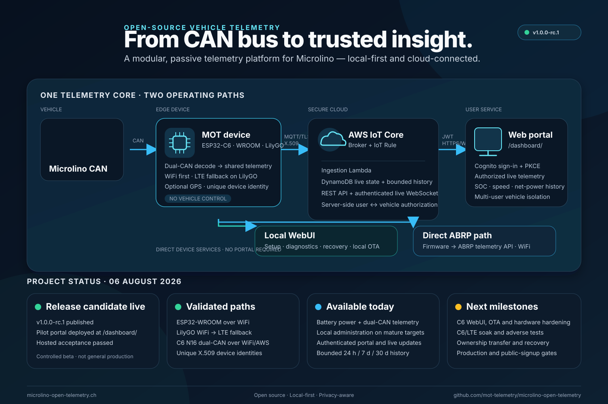
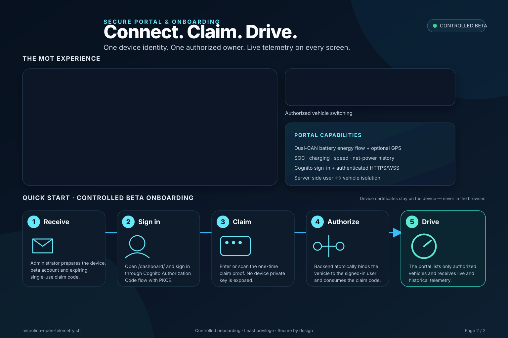

# Project Poster

> **Status:** Current marketing summary
>
> **Last reviewed:** 2026-08-04

The project poster summarizes the current high-level MOT architecture and the
validated pilot status. It is deliberately less detailed than the engineering
architecture pages and must not be used as runtime or release evidence.

The first page explains the telemetry architecture and project status. The second
page presents the portal and the controlled beta onboarding journey from invitation
and single-use claim proof to authorized live telemetry.

## Website summary

### Hardware and vehicle integration

Passive Microlino CAN telemetry on ESP32-WROOM and LilyGO T-A7670G, plus a bounded
nanoESP32-C6-N16 pilot with two simultaneous CAN inputs. The targets share the
same telemetry and decoder core; optional GPS is supported, and LilyGO can fall
back from WiFi to LTE.

### Local-first operation

The device-local WebUI remains available for setup, diagnostics, recovery and
local OTA. Cloud or portal outages do not remove the local administration path.
The optional ABRP integration is a separate direct path from the firmware to the
ABRP telemetry API over WiFi; it does not pass through the MOT cloud or portal.

### Secure portal and cloud

Each device connects to AWS IoT with its own X.509 identity. The hosted portal
uses Cognito sign-in, server-side vehicle authorization, authenticated REST and
WebSocket access, live telemetry and bounded history.

## Website status block

### Pilot live — next milestones in progress

- `v1.0.0-rc.1` is published and the reviewed pilot portal is deployed at
  `/dashboard/`.
- ESP32-WROOM over WiFi and LilyGO WiFi-to-LTE fallback have been physically
  validated with unique device identities.
- Controlled two-user vehicle isolation, device claiming, live telemetry and the
  bounded history path have passed hosted checks.
- Next: complete history observation and portal rollout, extend LTE qualification,
  and add ownership transfer/recovery before wider production use.

## Maintenance rule

Before publishing an updated poster or status block, compare it with
`docs/governance/CURRENT_STATUS.md` and `docs/governance/WORK_ORDER.md`. Avoid
future dates and capability claims that do not have current repository evidence.
