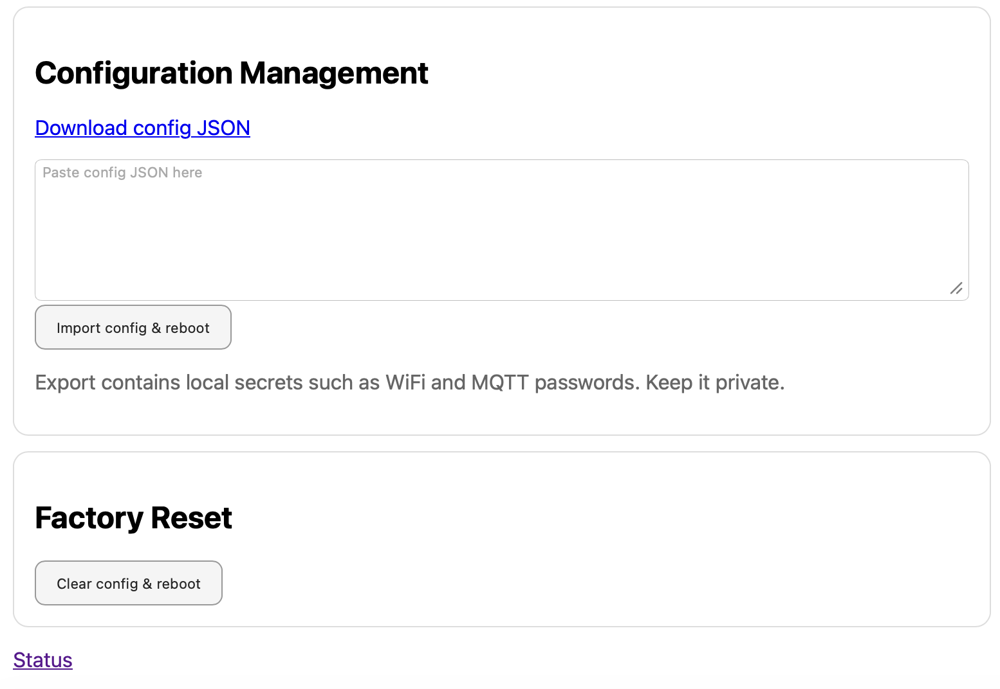

# Backup, Restore and Factory Reset

## Purpose

This page allows you to export the current configuration, restore a previous configuration or reset the device to factory defaults.

## Backup

Backup exports the current configuration as JSON.

Included:

- Device name
- Vehicle ID
- MQTT prefix
- WiFi configuration
- LTE/APN configuration
- MQTT broker and credentials
- OTA configuration
- ABRP configuration

Not included:

- Runtime counters
- GPS fix
- CAN counters
- Live telemetry values
- MQTT connection state

## Restore

Restore imports a previously exported JSON configuration.

After restore:

1. Reboot the device.
2. Check Network and MQTT pages.
3. Verify device name and vehicle ID.
4. Export a fresh backup after validation.

## Factory Reset

Factory Reset clears the stored configuration from the ESP32 preferences/NVS area and restarts the device.

Factory Reset removes:

- WiFi credentials
- MQTT settings
- LTE/APN settings
- OTA settings
- ABRP settings
- Device name and vehicle identifiers
- Other user configuration

Factory Reset does not remove:

- The installed firmware
- The WebUI filesystem
- The program code

After Factory Reset, the device returns to setup mode and exposes its local access point again.

## When to use what

| Situation | Recommended action |
|---|---|
| Before firmware update | Backup |
| Moving config to another device | Backup on old device, Restore on new device |
| Bad configuration | Factory Reset, then Restore |
| Selling or giving away device | Factory Reset |
| Testing new firmware | Backup first |

## Security note

Backup files can contain secrets such as WiFi password, MQTT password, OTA password or ABRP tokens. Treat them like password files and do not publish them.
