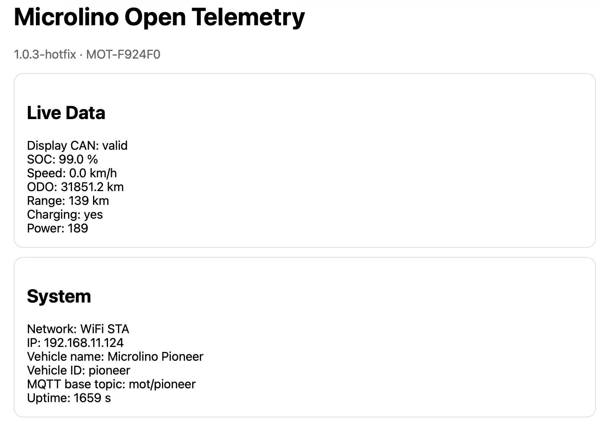

# Live status

## Purpose

The Live Status page exposes the current JSON status returned by the firmware. It is useful for debugging, documentation and API integration.

## Typical sections

| Section | Description |
|---|---|
| firmware | Firmware version and board |
| network | WiFi/LTE mode and IP |
| modem | LTE modem status |
| gps | GPS fix and location |
| can | CAN driver and counters |
| mqtt | Broker connection state |
| abrp | ABRP status |
| telemetry | Current vehicle telemetry model |

## Usage

Use Live Status when:

- A WebUI card looks wrong.
- You need exact field names.
- You want to compare WiFi and LTE behavior.
- You are documenting a bug report.

## Tip

Copy the JSON output together with the serial log when reporting firmware issues. It usually contains enough information to identify whether the problem is network, MQTT, GPS, CAN or configuration.
