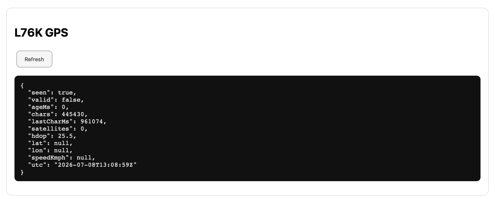
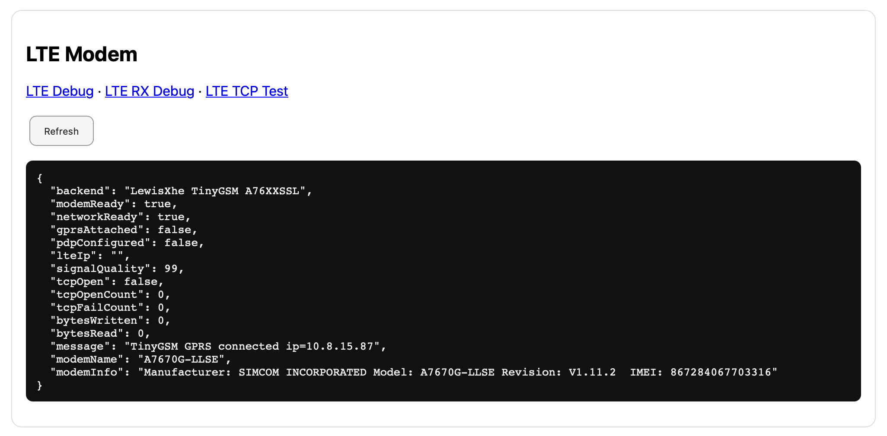

# LTE

## Purpose

The LTE page shows modem, network and GPRS/PDP diagnostics for the LilyGO T-A7670G platform.

## Current release status

| Function | Status |
|---|---:|
| Modem initialization | Working |
| SIM / registration | Working |
| GPRS/PDP | Working |
| LTE IP address | Working |
| TCP connect | Working |
| MQTT over LTE | Experimental |
| ABRP over LTE HTTPS | Deferred |

## Important fields

| Field | Meaning |
|---|---|
| Backend | LTE modem stack in use |
| Modem ready | AT/modem initialization succeeded |
| Network ready | Registered to mobile network |
| GPRS attached | Packet data attached |
| PDP configured | Data context configured |
| LTE IP | IP address assigned by provider |
| Signal quality | Modem CSQ-like signal indicator |
| TCP open count | Number of TCP open attempts |
| Bytes written/read | TCP data counters |

## Interpreting `TCP connected in ... ms`

This message means the modem opened a TCP connection to the configured host and port. It is not the same as MQTT being connected.

MQTT still needs to send `CONNECT` and receive `CONNACK` after TCP is open.

## Troubleshooting

| Symptom | Meaning |
|---|---|
| No LTE IP | APN, SIM or registration issue |
| TCP connect fails | Routing, DNS, firewall or provider issue |
| MQTT `rc=-4` | MQTT CONNACK timeout after TCP/MQTT CONNECT |
| WebUI slow during LTE | Blocking modem operation or retry loop |

## Best practice

Use a stable 5 V power supply and a good LTE antenna while debugging LTE. For field testing, use WiFi/hotspot until LTE MQTT is marked stable.
