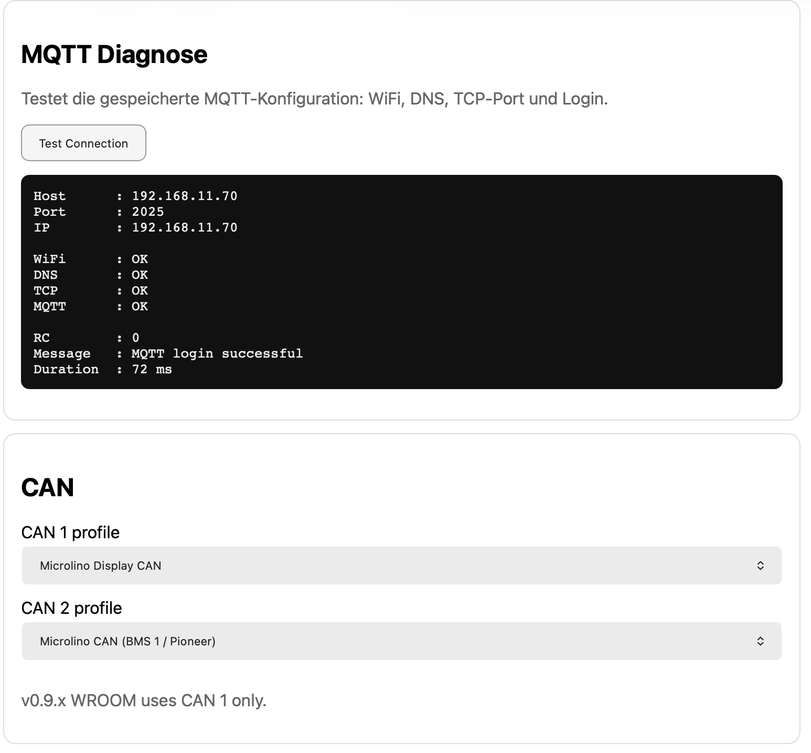

# MQTT and CAN



## Purpose

This page combines MQTT communication status and CAN diagnostics. It is one of the most important pages during field testing.

## MQTT status

Important fields:

| Field | Meaning |
|---|---|
| Enabled | MQTT broker is configured |
| Connected | Firmware is connected to the broker |
| Transport | Active path, usually `WiFi` or `LTE` |
| Client ID | MQTT client identifier |
| Publish count | Number of successful publishes |
| State / state text | PubSubClient connection state |

## CAN status

Important fields:

| Field | Meaning |
|---|---|
| Ready | TWAI/CAN driver initialized |
| RX pin | Configured CAN RX GPIO |
| TX pin | Configured CAN TX GPIO |
| Bitrate | CAN bus speed |
| Frames RX | Number of received CAN frames |
| Bus errors | CAN controller error counter |

## Expected values

For the current hardware:

```json
{
  "ready": true,
  "rxPin": 32,
  "txPin": 13,
  "bitrate": "500k"
}
```

## Typical checks

1. MQTT connected?
2. `publishCount` increasing?
3. CAN `framesRx` increasing when connected to vehicle?
4. No unexpected bus errors?

## Notes

System, GPS and heartbeat topics can be published even if no CAN frames are currently received. This helps validate MQTT independently from vehicle connection.
