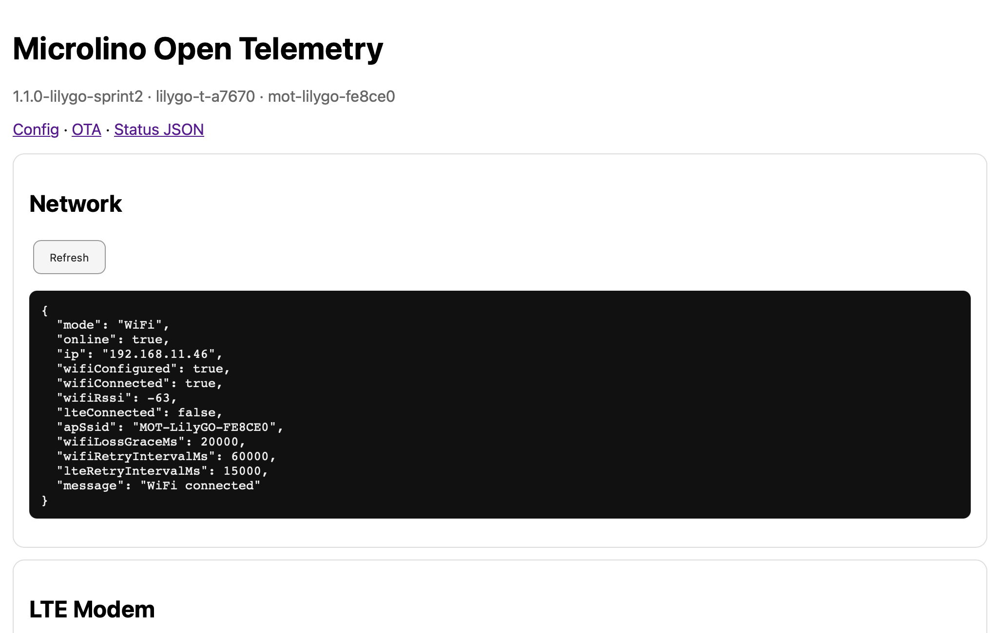
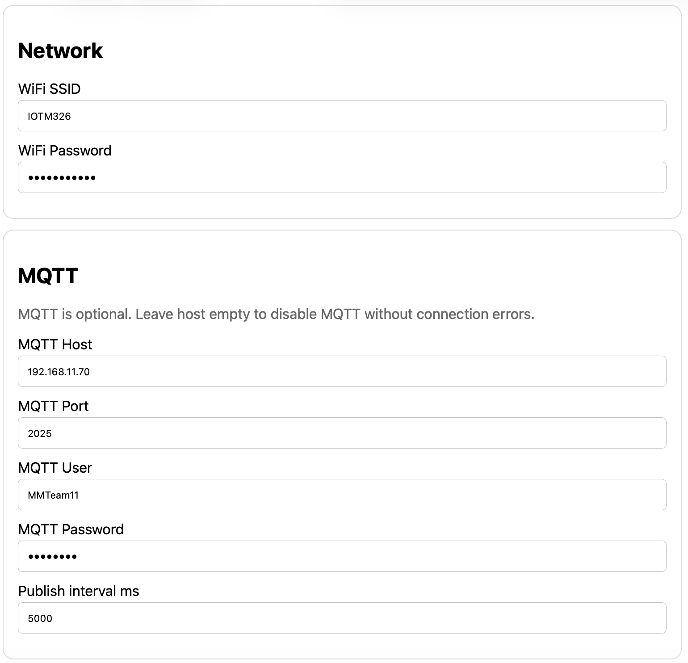
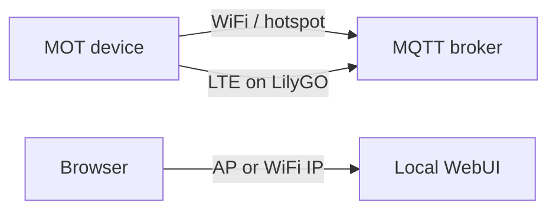

# Network

## Purpose

The network page configures how the device reaches the MQTT broker and how it exposes the local WebUI.

## Network paths

## WiFi

WiFi is currently the most stable path for field tests. A phone hotspot works well for mobile testing.

Typical values:

| Field | Meaning |
|---|---|
| WiFi SSID | Network name |
| WiFi password | Network password |
| WiFi IP | Assigned device IP |
| WiFi RSSI | Signal strength |

## LTE

LTE is available on the LilyGO T-A7670G firmware path. Network registration and PDP/GPRS are working, while MQTT over LTE is currently experimental.

## MQTT

The broker host, port, username and password are configured here or on the MQTT-related section of the WebUI.

## Best practices

- Test WiFi/hotspot first.
- Verify MQTT over WiFi before debugging LTE.
- Export a backup after network configuration.
- Keep AP access available during development in case WiFi credentials are wrong.

## Related pages

- [MQTT/CAN](mqtt-can.md)
- [LTE](lte.md)
- [Backup/Restore](backup-restore.md)
