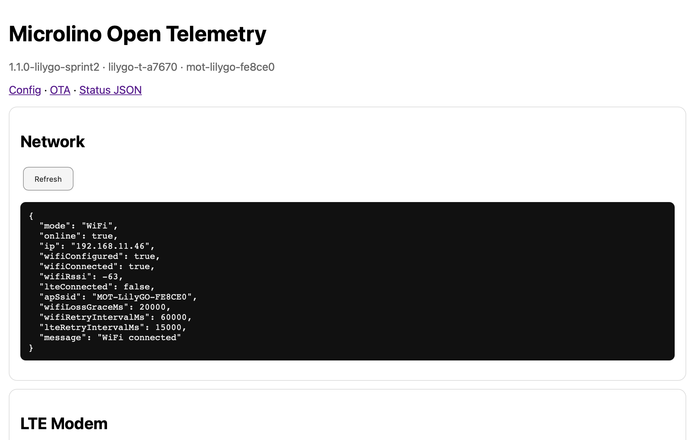
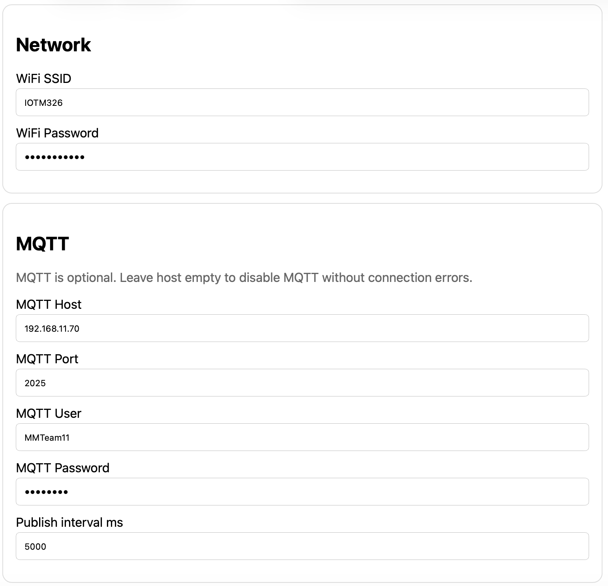
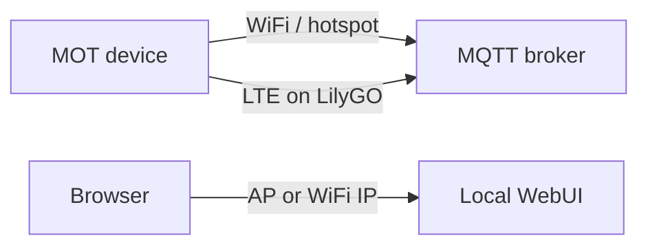

# Network

> **Status:** Behaviour validated; screenshots may be historical
>
> **Audience:** Beta user and support

## Purpose

The network page configures how the device reaches the MQTT broker and how it exposes the local WebUI.

## Network paths

```mermaid
flowchart LR
    Device[MOT device] -->|WiFi / hotspot| Broker[MQTT broker]
    Device -->|LTE on LilyGO| Broker
    User[Browser] -->|AP or WiFi IP| WebUI[Local WebUI]
```

## WiFi

WiFi is the preferred path when available. A phone hotspot remains useful during
setup and diagnostics.

Typical values:

| Field | Meaning |
|---|---|
| WiFi SSID | Network name |
| WiFi password | Network password |
| WiFi IP | Assigned device IP |
| WiFi RSSI | Signal strength |

## LTE

LTE is available on the LilyGO T-A7670G AWS firmware path. Network registration,
PDP/GPRS, device-certificate TLS and AWS IoT telemetry were functionally validated
with WiFi absent. Extended soak, weak-signal and power testing remain open. ABRP is
not transported over LTE.

## MQTT

The broker host, port, username and password are configured here or on the MQTT-related section of the WebUI.

## Best practices

- Test WiFi/hotspot first during provisioning.
- For a controlled LTE fallback test, disable WiFi and verify that the reported
  active AWS transport changes to `LTE`.
- Export a backup after network configuration.
- Configure the local administrator password before handoff; the operational AP
  uses it as its WPA2 password.

## Related pages

- [MQTT/CAN](mqtt-can.md)
- [LTE](lte.md)
- [Backup/Restore](backup-restore.md)
