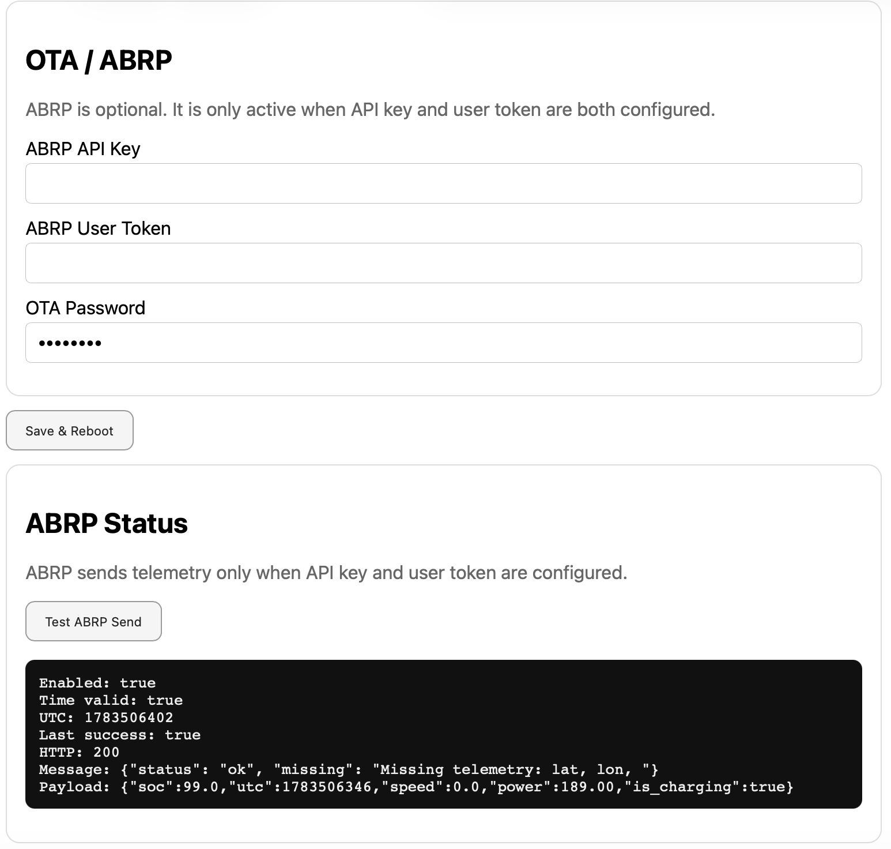

# OTA and ABRP

## Purpose

The OTA/ABRP page groups firmware update functionality and optional ABRP integration.

## OTA

OTA allows firmware updates through the local WebUI without opening the enclosure or using a USB cable.

Recommended OTA workflow:

1. Export a backup.
2. Build the new firmware.
3. Upload the firmware binary through OTA.
4. Reboot.
5. Verify dashboard and system health.
6. Export a new backup if configuration changed.

## ABRP

ABRP integration prepares telemetry for A Better Routeplanner.

Current status:

| Transport | Status |
|---|---:|
| WiFi | Retained |
| LTE HTTPS | Deferred |

ABRP over LTE is important for real mobile use, but it requires a stable secure HTTPS client path and must not block the WebUI.

## Best practices

- Keep OTA password configured.
- Do not expose OTA to untrusted networks.
- Export a backup before OTA.
- Verify the firmware version after update.
