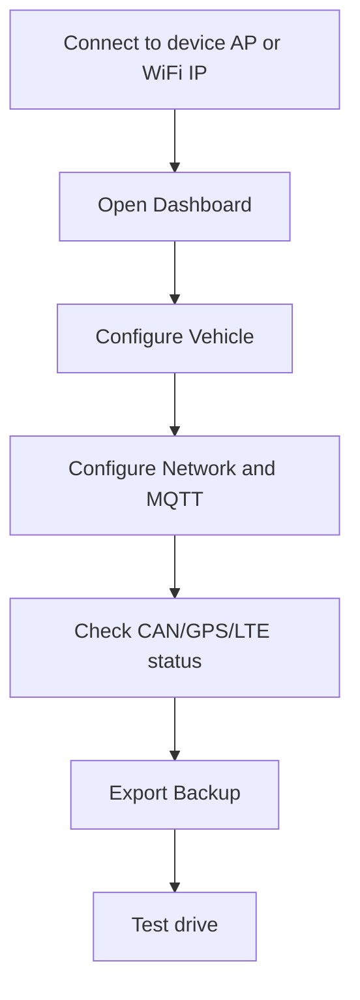

# WebUI overview

The local WebUI is the primary service and configuration interface of the MOT firmware. It is available through the device access point or through the configured WiFi network.

## What the WebUI is used for

- Check device status.
- Configure vehicle and MQTT settings.
- Configure WiFi, LTE and OTA.
- Inspect CAN, GPS, MQTT and modem diagnostics.
- Export and restore device configuration.
- Perform a factory reset.
- Upload firmware updates through OTA.

## Recommended workflow

## Pages

| Page | Purpose |
|---|---|
| [Dashboard](dashboard.md) | Quick device overview |
| [Vehicle configuration](vehicle-configuration.md) | Device and vehicle identifiers |
| [Network](network.md) | WiFi, LTE and MQTT setup |
| [MQTT/CAN](mqtt-can.md) | Broker status and CAN diagnostics |
| [LTE](lte.md) | LTE and modem diagnostics |
| [OTA](ota.md) | Firmware update and ABRP settings |
| [Backup/Restore](backup-restore.md) | Configuration backup, restore and factory reset |
| [Live status](live-status.md) | Live JSON status inspection |
| [System health](system-health.md) | Runtime and health diagnostics |

## Access point note

The device can expose a local setup AP. During development it may remain active even while WiFi is connected. A future security sprint will make AP protection and WebUI authentication configurable.
