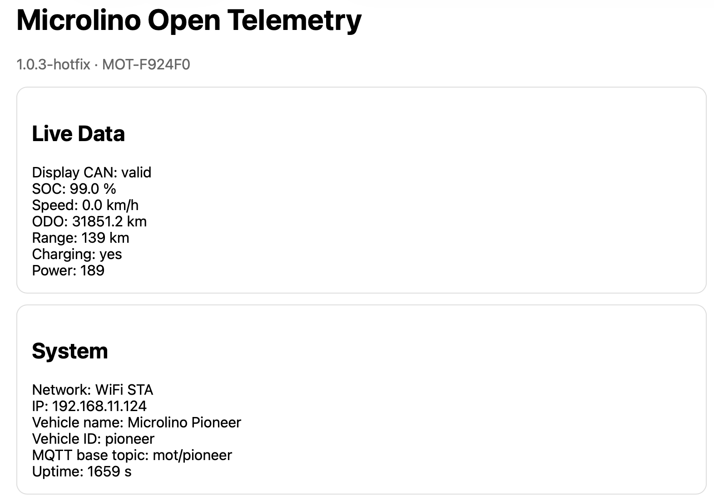
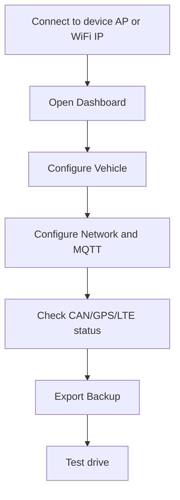

# WebUI overview

> **Status:** Source feature overview; screenshots and runtime unverified
>
> **Audience:** Beta user, support and firmware developer

The local WebUI is the primary service and configuration interface of the MOT firmware. It is available through the device access point or through the configured WiFi network.

## What the WebUI is used for

- Check device status.
- Configure vehicle and MQTT settings.
- Configure WiFi, LTE and OTA.
- Inspect CAN, GPS, MQTT and modem diagnostics.
- Export and restore device configuration.
- Perform a factory reset.
- Upload firmware updates through OTA.

## Recommended workflow

```mermaid
flowchart TD
    A[Connect to device AP or WiFi IP] --> B[Open Dashboard]
    B --> C[Configure Vehicle]
    C --> D[Configure Network and MQTT]
    D --> E[Check CAN/GPS/LTE status]
    E --> F[Export Backup]
    F --> G[Test drive]
```

## Pages

| Page | Purpose |
|---|---|
| [Dashboard](dashboard.md) | Quick device overview |
| [Vehicle configuration](vehicle-configuration.md) | Device and vehicle identifiers |
| [Network](network.md) | WiFi, LTE and MQTT setup |
| [MQTT/CAN](mqtt-can.md) | Broker status and CAN diagnostics |
| [LTE](lte.md) | LTE and modem diagnostics |
| [OTA](ota.md) | Firmware update and ABRP settings |
| [Backup/Restore](backup-restore.md) | Configuration backup, restore and factory reset |
| [Live status](live-status.md) | Live JSON status inspection |
| [System health](system-health.md) | Runtime and health diagnostics |

## Access and authentication

Operational WebUI and API routes on WROOM, LilyGO and C6 require the local `admin`
credential. Mutating routes also enforce a same-origin request boundary, and
operational fallback APs use WPA2 with the local administrator password.

The C6 additionally protects first setup: the device-specific password printed on
USB serial is required for its WPA2 setup AP and `setup` WebUI account. Never
expose these local interfaces directly to the public Internet. Screenshots still
require refresh after final C6 hardware acceptance.

If the `admin` password is lost, every supported firmware family provides a
physical recovery path over its 115200-baud USB serial console. Enter
`admin recover`; the device preserves its other configuration, replaces only
the administrator password with a random one and prints the replacement once
on that console.
