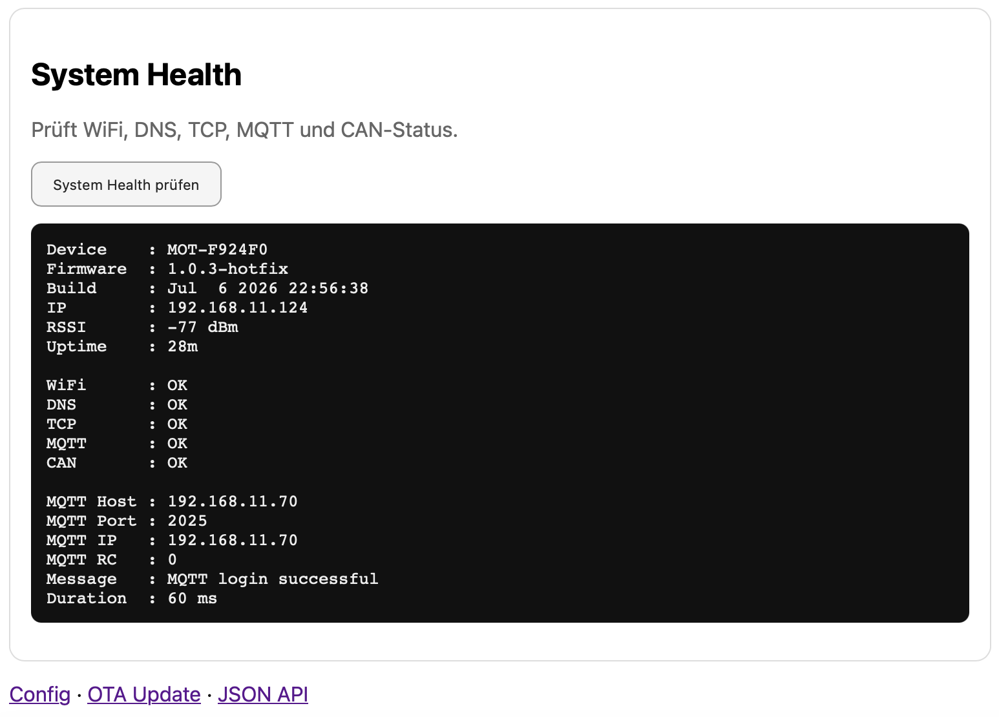

# System health

## Purpose

System Health summarizes runtime state and helps identify stability, memory, network or timing problems.

## Useful checks

| Field | Why it matters |
|---|---|
| Uptime | Confirms whether the device rebooted |
| Heap / memory | Helps detect leaks or memory pressure |
| Network mode | Shows active route |
| WiFi RSSI | WiFi signal quality |
| LTE state | Mobile network state |
| MQTT state | Broker connectivity |
| GPS age | Whether GPS data is fresh |

## Interpreting problems

| Symptom | Possible cause |
|---|---|
| Uptime resets unexpectedly | crash, watchdog or power issue |
| WebUI becomes slow | blocking LTE/modem operation |
| MQTT disconnected | broker, credentials, WiFi/LTE path |
| GPS age grows | GPS serial or reception problem |
| LTE reconnect loops | APN, modem, power or transport issue |

## Best practice

Check System Health before and after test drives. It gives a quick indication whether the firmware stayed stable over time.
