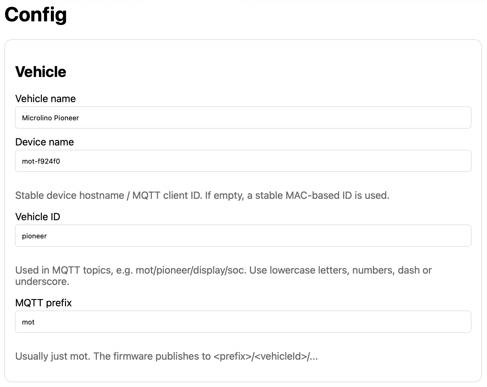

# Vehicle configuration

## Purpose

The vehicle configuration page defines the identity of the device and the vehicle. These values are used by MQTT topics, backups, diagnostics and user-facing labels.

## Important fields

| Field | Description |
|---|---|
| Device name | Human-readable device name, also used to derive MQTT client ID |
| Vehicle ID | Vehicle identifier used in MQTT topic paths |
| MQTT prefix | Root topic prefix |
| OTA password | Password for firmware updates |
| ABRP credentials | Optional ABRP API key and user token |

## Best practices

- Use a stable `vehicleId`; changing it changes the MQTT topic tree.
- Use a unique device name for each hardware unit.
- Export a backup after configuration changes.
- Treat credentials as secrets.

## Related pages

- [Network](network.md)
- [Backup/Restore](backup-restore.md)
- [OTA](ota.md)
